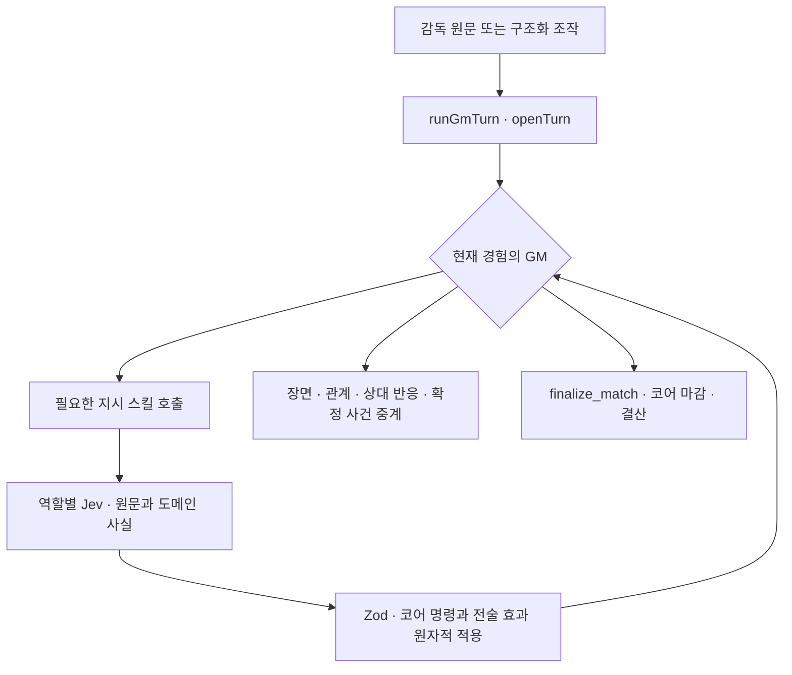

# 에이전트 — 누가 무엇을 하나

**생성형 에이전트와 Jev 해석기는 기존 호출 자리에서 서로 다른 일을 한다.** 평시 GM이
`tactic_orders`·`training_orders`·`market_orders`, 협상 GM이 `negotiation_orders`를
필요할 때 호출하면 해당 Jev 해석기가 감독 원문과 그 도메인의 문맥에서 명령 인자를
반환한다. 일반 대화 앞에는 해석기를 실행하지 않는다. 공통 컴파일러는 내부 구현을
공유할 뿐, 새 라우터나 모든 발화를 검사하는 에이전트가 아니다.

경기 지시의 타입 판독과 생성형 결산, 훈련 평가, 이력 압축, 온보딩은 각각 다른 근거를 읽는다.
산문과 시트 강도를 분리하는 실험은 `harness/`의 기록 비교 전용이다.

이야기의 작업 기억은 GM의 컨텍스트이고 오래 남는 기억은 이력 압축이 쓴다.
상태는 검증된 코어 명령으로만 바뀐다. 선수 능력·포지션·역할·체력·적응·폼과 경기 결과,
재정·계약·약속 장부는 이 책임 분리로 대체되거나 감춰지지 않는다.

모델 배치는 [models.md](models.md), 입력·출력 규약은 [prompts.md](prompts.md)에 있다.

## 0. 용어

**스킬**은 GM이 직접 부르는 도구다. 생성형 에이전트가 반환하는 JSON은 **출력
스키마**이고, Jev가 받는 Choice·Noul·Score는 **평가 질문**이다. 둘 다 실행 도구가
아니다. 검증된 값으로 상태를 바꾸는 결정적 함수는 **코어 명령**이다.

## 1. 호출과 책임의 목록

아래 표는 누가 호출을 시작하는지와 어떤 상태 경계를 갖는지를 함께 적는다.
설정 키와 실제 모델은 `config/llm.yml`, 스킬의 정확한 선언은 `SKILL_CATALOG`와
`MATCH_TOOL_DEFINITIONS`·`NEGOTIATION_TOOL_DEFINITIONS`가 소유한다.

운영 설정과 호출 목록은 **생성형 7개와 타입 평가 역할 5개**만 갖는다. 비교 전용
생성형 판독기의 프롬프트·파이프라인은 `harness/`에 두며 운영 출력 목록에 등록하지 않는다.
비교 실행은 `--baseline-agent`로 기존 생성형 역할의 모델 설정을 명시적으로 선택하고,
강도 평가에는 `evaluators.match-reader` 설정을 사용한다. 비교 역할 이름은 과거 로그를 읽는 용도로만 남는다.

| 호출 / 설정 키                      | 누가 시작하는가               | 책임과 경계                                                                               |
| ----------------------------------- | ----------------------------- | ----------------------------------------------------------------------------------------- |
| 평시 GM / `gm`                      | 평시 턴                       | 서사·관계·진행·조회 스킬. 지시는 `tactic_orders`·`training_orders`·`market_orders`로 전달 |
| 매치 GM / `match-gm`                | 경기 턴                       | 확정 사건 중계·벤치 대화. `tactic_orders`·`team_talk`·`finalize_match`                    |
| 협상 GM / `negotiation-gm`          | 협상 방 턴                    | 설득·상대 반응. `negotiation_orders`·`counterparty_reply`·`leave_negotiation`             |
| 평시 전술 / `tactic-orders` (Jev)   | 평시 `tactic_orders`          | 현재 전술·선수 사실과 원문에서 명령 선택                                                  |
| 훈련·육성 / `training-orders` (Jev) | `training_orders`             | 훈련·육성 명령 선택                                                                       |
| 시장·재정 / `market-orders` (Jev)   | `market_orders`               | 선수·오퍼·금융의 명령 선택                                                                |
| 협상 조건 / `table-orders` (Jev)    | `negotiation_orders`          | 현재 방에 고정한 값·조건·수락·철회                                                        |
| 경기 전술 / `match-reader` (Jev)    | 경기 `tactic_orders`          | 직접 명령과 복합 전술 효과. 원문 출처와 시트는 함께 검증·적용                             |
| 경기 결산 / `finalize-match`        | 마감 스킬 또는 마감 보장 경로 | 평점·성장·심경, 코어 앵커 ± 한도. 실패하면 앵커 유지                                      |
| 훈련 결산 / `training-rater`        | 날짜 진행                     | 훈련 구간 평가, 코어 앵커 ± 한도                                                          |
| 이력 압축 / `history-compactor`     | 평시 이력 창 상한             | 요약·인물 기억, 실패하면 접지 않음                                                        |
| 온보딩 / `onboarding-judge`         | 새 게임 생성                  | 초기 조건·사건·첫 장면, 실패하면 생성 중단                                                |



일반 대화에는 선행 평가가 없다. 네 지시 스킬이 필요할 때만 내부 해석기를 부른다.
`tactic_orders`는 평시에는 `tactic-orders`, 경기에는 `match-reader`를 사용한다.
라우팅은 `state.phase`가 정하지만 이 값 자체를 모델 입력에 싣지 않는다.

### 직접 지시의 적용 경계

`createInstructionTool`은 인자가 없는 스킬이며, 모델이 감독 발화를 다시 쓰지 못한다.
앱이 보관한 이번 턴 원문을 `runInstructions`에 넘기고, 같은 스킬은 한 턴에 한 번만
해석한다. 각 호출은 그 역할의 명령 목록만 본다. 구조화 조작은 이미 코어가 적용한
값이며 표시 문구를 자연어로 재실행하지 않는다. 빈 원문에는 평가를 보내지 않는다.

질문·가정·인용·부정과 실행할 지시를 구분하고, 선수·협상·날짜는 현재 후보를 선택한다.
금액·수·문자열은 감독 원문에서 근거가 있는 값만 옮긴다. **분류 확률은 의도의 확률이지
강도가 아니다.** 금액·계약·명령을 확률 평균으로 섞거나 자신감을 효과에 곱하지 않는다.

선택이 모호하거나 필요한 값이 없으면 **해당 스킬의 지시 묶음을 보류**하고 확인할 내용을 GM에게
넘긴다. 일부만 실행하지 않는다. 명령 묶음은 복제 상태와 임시 호출·journal에서 검사한다.
하나라도 코어가 거절하면 묶음이 만든 상태·금전 장부·호출 기록·명령 journal을 전부 반영하지 않고, 전부
성공한 경우만 원상태와 기록에 합친다. 평가 시도와 보류 사유의 진단 기록은 남는다.
서로 다른 역할 스킬을 여러 번 부른 턴에서는 각 스킬의 묶음이 이 경계를 따르며,
여러 스킬을 하나의 전역 트랜잭션으로 합치지는 않는다. 실패를 생성형 해석기로 우회하지 않는다.

선택지는 원문·코어 스키마·현재 명단과 지명된 선수·역할·포지션에서 만든다. 날짜
후보는 오늘부터 90일 뒤까지와 원문에 명시된 유효 ISO 날짜이며, 후보에 없거나 선택이 모호하면 확인한다. 숫자·문자열
후보를 놓쳤다는 이유로 임의 값을 보충하지 않는다. 배열·객체는 최대 8단계의 적응형
질문으로 펼치며 배열 32항목·선택지 255개·질문 512개·발화 8,000자 상한을 넘으면
잘라 적용하지 않고 보류한다. 단순 스칼라 명령도 의도와 인자를 나누어 평가하므로
평가 요청 하나가 언제나 지시 전체인 것은 아니다.

Choice 인자는 유일한 최대 선택지가 과반 확률을 얻어야 채택한다. 이는 보수적인
기권 조건이며 보정된 정확도나 한국어 품질 보증이 아니다. 육성·멘토 목록의 추가·제거·
교체·전체 해제는 선택된 목록 모드와 현재 명단을 코어가 합성하고, 관계없는 기존 항목을
유지한다. 명시적 전체 해제와 값 누락은 다른 지시다.

## 2. GM — 평시

한 턴은 한 장면이다. 도구를 다 부른 뒤 장면을 한 번에 쓰고, 감독을 대신 연기하지 않는다
(문법과 철칙은 [prompts.md](prompts.md)).

- **직접 지시는 해당 스킬 안에서 검증한다.** GM이 필요한 지시 스킬을 부르면 Jev가
  원문을 해석하고, 적용·보류 결과가 도구 답으로 돌아온다. GM은 그 결과로 장면·후속 질문을 쓴다.
- **우리 오퍼에 온 답은 GM이 판정하지 않는다** — 감독이 나서지 않은 라운드는 그날의
  tick이 앵커로 굳히고, 결과가 사건 한 줄로 온다. GM은 그것을 장면으로 옮긴다 — 메일이
  왔는지 단장이 전화로 알렸는지는 장면의 것이다 (§4-1).
- **직접 나서는 일은 평시의 도구가 아니다** — 감독이 협상 상대와 직접 이야기하겠다고 하면
  `start_negotiation`으로 방을 열고 그 턴은 그 자리로 향하는 장면까지만 쓴다. 상대의 말과
  값·조건은 방 안의 협상 GM이 맡는다(§4-1). 상대가 없는 자리에서 오퍼를 넣고 접고 답하는
  것은 `market_orders` 안의 직접 지시 명령이다.
- **턴은 감독의 다음 말 하나를 제안하며 닫힌다** — GM 셋(평시·경기·협상 방)이 장면의
  **마지막 줄**에 `<suggest_reply>…</suggest_reply>`로 낸다 ([prompts.md](prompts.md) §1).
  도구가 아니라 출력 문법인 이유는 왕복이다: 도구로 받으면 턴마다 모델 호출이 하나 늘고,
  GM이 쓰는 Gemini는 implicit 캐시라 그 호출의 입력이 정가로 다시 읽힌다 — 기록의 GM 호출
  대부분이 `cacheRead 0`이다 ([models.md](models.md) §4). 코어가 위생 **앞에서** 값을
  꺼내(`takeSuggestion`) `GmTurnResult.suggestion`으로 올리고, 태그 줄은 꺾쇠 블록이라
  위생이 화면과 저장에서 함께 걷는다. 화면은 그것을 입력창의 placeholder로 세우고 Tab·→가
  입력으로 받는다 ([../ui/design-system.md](../ui/design-system.md) §6). 감독이 한 말이
  아니므로 세이브의 턴(`ChatTurn.suggestion`)에만 남고 이력·압축 브리프·해석기 입력 어디에도
  실리지 않는다 — 다음 턴의 모델은 지난 턴의 제안을 모르고, 감독이 보낸 것만 감독의 말이다.
  태그가 없거나 값이 1\~80자 밖이면 그 턴엔 제안이 없고 장면은 그대로다. 장면 안에 선택지를
  늘어놓는 것은 그대로 금지다.
- **손잡이는 문장이 아니라 구조체로 온다.** 화면은 `TurnOperation`을 API에 넘기고
  (`{ kind: "skip_days", days }` · `{ kind: "skip_to_next_match", date }` ·
  `{ kind: "enter_match" }` · `{ kind: "match_stop" }` ·
  `{ kind: "enter_negotiation" }` · `{ kind: "leave_negotiation" }`),
  프롬프트에 실리는 `<operator>…</operator>` 문구는 서버가 그
  구조체에서 만든다(`operationLabel`). 문장을 되읽는 정규식은 없다 — UI 문구 한 글자에
  시계·배치가 갈리던 자리가 여기였다.
- 코어가 한 일은 **한글 이름으로** 기록되고 칩으로 세우지 않는다 — 시계 이동은
  `시간 경과`다. 호출 이름은 영문이므로 둘은 한눈에
  갈리고, 카탈로그에 없는 영문 이름이 트레이스에 서지 않는다.
- **무엇을 감출지는 이름이 아니라 표식이 정한다** (`ToolCallRecord.silent`). 스킬 카탈로그에
  없는 이름을 걸러 내면 코어가 남기는 기록이 함께 사라진다 — 경기 마감(`finalize_match`)은
  칩과 말풍선(**대회 · "경기 종료"**)으로 서고, 시계 이동과 결산만 표식으로 감춘다.
- **기록은 성공한 호출만 남긴다** (`recordCall`). 실패한 호출은 세계를 움직이지 않았으니
  칩도 말풍선도 설 자리가 없고, 왜 안 됐는지는 그 턴의 장면이 말한다. mock도 같은
  함수를 쓴다(§8).
- **첫 장면에는 폴백이 없다** (§4-2). 실패·잘린 응답(`stopReason === "truncated"`)·문법
  위반은 한 번 다시 시도하고, 그래도 안 되면 게임 자체를 만들지 않는다. 검사는 문법과
  화자까지만 본다 — 2\~12줄, 모든 줄이 `@`로 시작, 수석코치가 등장, **감독은 말하지 않는다**.
- **장면 위생은 코어가 건다** — 저장 직전의 `sanitizeSceneText`와 스트리밍의
  `filterSceneStream`이 도구 앞에 흘린 작업 서술과 **값이 같은 반복 시점 헤더**를
  걷어낸다(시각이 달라진 헤더는 장면 전환이라 남는다). 화면과 저장에 같은 것이 서도록
  **둘은 언제나 함께 걸린다**. 헤더 규칙은 평시 GM 턴만이다
  ([prompts.md](prompts.md) §1).
- **꺾쇠 블록은 두 국면이 함께 걷는다** — `<points>`·`<ledger>`는 코어가 읽으라고 넣어
  준 입력 구조라, 모델이 되받아 쓴 것은 평시든 중계든 장면이 아니다. 중계는 그 규칙
  하나만 읽는다(`sanitizeCasterText`·`filterCasterStream`). 문이 코어에 서 있으므로
  모델이 흘려도 화면은 깨지지 않고, 저장된 턴이 다음 턴의 이력으로 돌아가 같은 블록을
  다시 부르는 되먹임도 여기서 끊긴다.
- **도구를 다 쓴 턴도 장면으로 끝난다.** 왕복 상한(8회)의 **마지막 한 번은 도구 없이**
  나가므로([models.md](models.md) §3), 조회와 실행으로 상한을 채운 턴도 문장을 받고
  돌아온다. 그래도 장면이 비면 **코어가 이번 턴의 기록으로 model 턴을 세운다** —
  호출이 남긴 요약을 `@:` 내레이션으로 적을 뿐, 대사를 지어내지는 않는다. 라인업과
  훈련이 바뀐 채 빈 턴이 저장되면 감독은 지시가 먹혔는지 채팅으로 알 수 없다. 기록도
  장면도 없으면 아무것도 저장하지 않고 턴을 되돌린다(§8).

### 시계 — 출처가 날짜의 주인을 정한다

코어의 시계 입구는 **둘**이고 둘 다 `app/tick.ts`에 있다. 손잡이가 누른 만큼을 모델보다
**먼저** 굴리는 `advanceForOperation`, 그리고 장면이 닿은 곳을 모델 **뒤에** 따라가는
`applyScenePoint`다. 뒤쪽은 이번 턴 **날짜의 주인**(`ClockSource`)을 함께 받고, 날짜를
미는 규칙은 그 출처가 갖는다 — GM은 턴마다 한 번만 부른다.

| 출처                | 언제             | 날짜                                                                          | 그 날 안의 시각      | 선언한 날에 못 닿으면                            |
| ------------------- | ---------------- | ----------------------------------------------------------------------------- | -------------------- | ------------------------------------------------ |
| `header` — 헤더     | 평시의 보통 턴   | 헤더가 가리키는 날까지 굴린다 (경기일·시즌 종료·기한 당일 협상 앞에서 멈춘다) | 그 날에 닿았을 때만  | `short` — `시간 경과` 기록으로 남는다            |
| `operator` — 손잡이 | 손잡이가 굴린 턴 | 고정 — 코어가 턴 앞에서 이미 옮겼다                                           | 되감지 않고 따라간다 | 남기지 않는다 — 날짜를 요청한 것이 헤더가 아니다 |
| `ledger` — 장부     | 경기 중·경기일   | 고정 — 하루가 넘어가면 훈련·성장·협상이 통째로 굴러 버린다                    | 되감지 않고 따라간다 | `short` — `시간 경과` 기록으로 남는다            |

- **경기 중 고정은 출처와 무관하게 걸린다.** 판이 열려 있으면(`state.phase !== "idle"`)
  주인을 무엇으로 넘겼든 날짜는 서 있다 — 규칙이 부르는 쪽이 아니라 코어에 있다.
- **시각은 세 출처 모두에서 흐르고, 되감기지 않는다.** 경기는 몇 시간에 걸친 일이라
  시계를 통째로 묶으면 상단 띠가 킥오프 시각에 얼어붙는데 채팅의 장면 시각은 계속
  흐르므로 **한 화면의 두 시계가 갈린다.**
- **헤더가 여럿이면 시계는 마지막 것을 따라간다** (`lastScenePoint`). 한 턴 안에서
  시간이 흐르면 위생이 그 전환 헤더를 남기므로([prompts.md](prompts.md) §1), 장면이
  실제로 닿은 곳은 마지막 헤더다. 첫 헤더로만 밀면 채팅은 오후를 세우는데 상단 띠는
  오전에 남아 같은 갈림이 난다.
- **헤더를 못 읽은 멎음은 세어 둔다** — 자유 텍스트가 상태를 움직이는 유일한 경로라
  실패가 조용히 누적된다. 헤더를 못 읽은 평시 턴이 연달아 `STALLED_CLOCK_TURNS`(3)에
  이르면 그 수가 턴 결과(`GmTurnResult.clockStalled`)로 올라가고 화면이 띠로 세운다.
  헤더가 한 번 읽히거나 손잡이가 시계를 옮기면 `0`으로 돌아간다
  (`state.sceneHeaderMisses`). 첫 줄은 로그에 남는다.
- **경기 장면의 분은 시계가 아니다** — 중계의 첫 줄은 장부의 분으로 덧씌워진다
  (`stampMatchScene` — §3 ④). 모델이 적은 분은 화면에 닿기 전에 걷히고, 장부와 갈렸다는
  사실만 로그에 남는다.

### 턴은 앞·호출·뒤로 흐른다

실모드 GM 턴은 `openTurn → callGm → closeTurn`을 지난다. 턴 앞은 시간 조작·카드·
전술판 적용을, 호출은 국면별 입력·도구 루프·장면을, 턴 뒤는 장면 위생·시계·마감·
훈련 결산·저장할 본문을 맡는다. `runInstructions`는 독립 선행 단계가 아니라 GM의
지시 스킬 핸들러 안에서 실행된다.

## 3. 경기 — 타입 지시·중계·결산

경기 시계와 결과는 클라이언트 공간 시뮬레이터와 서버 체크포인트가 확정한다.
킥오프·골·카드·부상·하프타임에 포인트 산문을 생성하는 호출은 없다. 매치 GM은
확정 사건을 중계하고, 감독이 전술을 지시하면 `tactic_orders`를 부른다.

| 계기      | 호출 관계                                                       | 결과                                            |
| --------- | --------------------------------------------------------------- | ----------------------------------------------- |
| 킥오프    | 경기 시작 → 매치 GM                                             | 첫 휘슬 장면, 초기 시트는 비어 있음             |
| 전술 지시 | 매치 GM → `tactic_orders` → Jev `match-reader` → 코어 → 매치 GM | 명령·전술 효과 적용 또는 묶음 보류, 세계의 반응 |
| 정지점    | 체크포인트 확정 → `match_stop` → 매치 GM                        | 확정 사건 중계, 기존 전술 효과 유지             |
| 종료      | `finalize_match` → 코어 마감 → 결산 → 매치 GM                   | 검증된 평점·성장·심경과 마무리 장면             |

### 매치 GM (`match-gm`)

이 경기의 중계 이력, 감독 원문, 확정 `<events>`와 현재 장부·전술을 읽는다.
`tactic_orders`는 원문 지시, `team_talk`은 실제 대화가 마무리된 자리의 반응·약속·심경,
`finalize_match`는 종료 장부의 마감을 맡는다. 장면의 분·골·카드는 코어 사건에서 오고,
도구가 실행되거나 델타가 나간 호출은 통째로 재시도하지 않는다.

### 경기 판독 (`match-reader`) — Jev 명령과 전술 효과

`interpretMatchInstructions`는 현재 전술·선수 사실, 감독 원문과 `buildRecentFlowBlock`의
최근 관측 구간으로 직접 명령과 `set_match_plan` 타입 후보를 고른다. 이는 GM 스킬을
추가한 것이 아니라 공통 컴파일러 안에서 복합 효과를 다루는 출력 계약이다.
능력·포지션·역할·체력·적응·폼은 별도 사실로 유지한다.

직접 명령의 의도 단계에는 명령 계약을 전달하고, 복합 전술은 이름·설명으로 실행
의도를 고른 뒤 선택된 명령의 인자 단계에 출력 스키마를 전달한다. 앞 단계에서
선택한 모양·동작에 따라 적용 가능한 필드만 해석한다. 선행 선택이 아직 없으면
해당 필드를 다음 구조 단계로 미루며 수치 효과에는 개인 동작 필드를 묻지 않는다. 맨마킹은 선수만,
공격 방향 효과는 편과 레인, 형태 유지는 편만 묻는다. 쓰이지 않는 대상 필드를 다시
추정하지 않으며 기존 대상 평가 단계 안에서 처리해 호출 단계를 추가하지 않는다.

복합 효과는 대상·모양·동작을 타입으로 고른다. 코어에서 부호·강도를 쓰지 않는
`behavior`는 `sign=1, step=1`로 정규화하고 불필요한 수치 평가를 생략한다. 나머지
수치 효과는 -3부터 +3까지 일곱 방향·강도 눈금의 Score 분포를 받는다. API 인덱스
0–6의 기대값에서 3을 뺀 값을 부호와 절댓값으로 나눠 기존 `sign`·`step`에 전달한다.
confidence를 강도에 곱하지 않는다. `replace`는 새 효과 전체로 교체,
`clear`는 명시적 전체 해제, `keep` 또는 전술 효과가 없는 출력은 이전 효과 유지다.
단순 교체·자리·역할·6축 변경만으로 복합 효과를 새로 만들지 않는다.

`Point`는 생성형 분석 문장이 아니라 **감독 원문 출처 메타데이터**다. 코어 쪽에서
정한 id와 원문의 `POINT_TEXT_MAX` 이내 앞부분, 효과의 대상 목록을 붙인다. Jev는
포인트 산문을 생성하지 않는다. 각 시트 줄은 이 출처를 가리킨다.

명령과 효과는 같은 복제 상태에서 Zod·대상 실재·팀 예산·대가·소화율을 검증한다.
반려되는 명령이나 효과가 하나라도 있으면 새 묶음 전체를 적용하지 않는다. 기존 효과는
유지되고 확정 경기 사건은 바뀌지 않는다. 성공한 효과는 확정 tick의 입력 로그에 남아
브라우저·서버 재실행이 같은 시트를 쓴다. 인프라 오류는 호출 실패로 올라간다.

### 경기 마감 (`finalize-match`) — 결산만

코어 `finalizeMatch`가 결과와 평점 앵커를 세운 뒤 결산 에이전트가 이 경기의 중계와
사실을 읽어 평점·성장·심경을 반환한다. Zod와 코어의 앵커 ± 한도를 통과한 값만
반영한다. 실패하면 앵커를 유지하고 경기 결과를 되감지 않는다.

결산의 출력에는 `closing`이 없다. 마무리 중계는 결산 결과를 받은 **매치 GM이 한 번만**
쓴다. 도구를 부르지 않아도 종료된 경기는 코어의 마감 보장 경로가 마감한다.

### 대화만 건 턴은 시계를 옮기지 않는다

경기의 시간은 실행기가 진행하고 서버가 검증한다. 감독 발화나 대화 판정은 경기
분을 만들어 내지 않으며, 정지·재개와 x1 예측 진행은
[live-match.md](../../match/live-match.md) §8의 규칙을 따른다.

## 4. 결산 — 앵커 ± 한도

자주 도는 판정은 전부 같은 구조다: **코어가 앵커를 박고, LLM이 맥락으로 다시 매기고,
코어가 한도로 자른다. 실패하면 앵커가 남는다.** 결산은 둘이다 — 훈련과 경기. 심경은
결산이 아니라 **잔향**이다(§4-3).

| 결산                    | 언제                                         | 누가                                           | 대상                                | 폭                                                                           |
| ----------------------- | -------------------------------------------- | ---------------------------------------------- | ----------------------------------- | ---------------------------------------------------------------------------- |
| 훈련 (`training-rater`) | 시간이 흐른 뒤, 그 구간을 **한 묶음으로**    | 별도 호출 — 싼 자리                            | 그 구간에 훈련한 1군 (부상·정지 밖) | **한 주치** 전술 적응도 −1\~+3 · 자리 0\~2 · 능력치 **최대 6명** 각 ±1       |
| 경기 (`finalize-match`) | `finalize_match` 도구 안, `finalizeMatch` 뒤 | **경기 마감 에이전트** — 중계 전부를 읽고 (§3) | 출전 선수 전원                      | 앵커 ±1.2 + 근거 한 줄 · 전술 적응도 −2\~+8 · 능력치 11명까지 · 심경 8명까지 |

- **훈련만 별도 호출로 남는 이유는 무게다.** 구간의 훈련 표 25행은 장면 턴에 얹기엔
  무겁고, 산출 25행이 장면을 밀어낸다 — 싼 자리가 맞다. 경기 결산도 별도 호출이지만
  읽는 것이 다르다 — 이 경기의 중계 전부가 `<commentary>`로 간다.
- ⚠️ **훈련 결산이 보는 구간은 턴이 시작한 시점부터 도착한 시점까지다.** 시계가 도는
  자리가 둘이라(§2) 시작점은 **장면보다 먼저** 잡아야 한다 — 손잡이 턴은 코어가 장면
  전에 이미 날짜를 옮겨 두므로, 장면 뒤에 잡은 시작점은 도착한 날짜와 같아져 구간이
  길이 0이 되고 훈련이 아예 돌지 않는다.
- ⚠️ **판정의 눈금은 한 주치이고, 폭을 접는 것은 코어다.** 결산은 턴이 넘긴 구간마다
  도므로 호출 횟수는 감독의 페이스가 정한다 — 눈금이 결산당 고정이면 하루씩 진행한
  감독이 같은 훈련으로 다섯 배를 가져간다. 그래서 판정자는 지금의 사다리를 그대로
  내고, 코어가 반영할 때 `세션 수 ÷ SESSIONS_PER_WEEK`를 곱한다. **프롬프트에는
  구간의 길이를 알리지 않는다** — 훈련 일지가 이미 며칠치인지 말하고, 눈금을 두
  곳에서 접으면 두 번 접힌다 ([../data/player.md](../player.md) §6.1).
- **훈련을 세션마다 부르지 않는 이유**는 훈련엔 경기 같은 사건 목록이 없어 하루치만 보면
  판단할 거리가 없어서다. 그 구간의 훈련 일지 · 그 구간의 대화와 **장부 골격** · 개인
  지시가 함께 간다.
- **대화 창은 「지난 결산 이후」다** — 이 턴의 시작 날짜가 아니라 **마지막 결산 카드의
  `to`**(카드가 없으면 이 턴의 시작)에서 연다. 시계가 움직이지 않은 턴이 이어지거나
  훈련 없는 구간이 끼면 그 사이의 대화가 어느 브리프에도 안 실리는 자리가 생기기
  때문이다. 결산 카드는 판정이 돌지 않은 구간에도 서므로 이 기준은 언제나 있다
  (→ [../simulation/season.md](../season.md) §4). 길이 난간(`CHAT_KEEP`)은
  그 위에 그대로 선다.
- **훈련 브리프의 대화는 장면이지 코치의 말이 아니다.** 모델 턴의 화자는 「장면」으로
  라벨된다 — 그 턴에는 구단주·선수·기자의 말이 함께 있어 「코치」로 붙이면 판정자가 남의
  말을 코치의 지시로 읽는다. 감독이 실제로 무엇을 걸었는지는 그 턴의 **장부 골격**
  (`turnFactLines` — 호출의 요약과 코어 기록을 `[장부] …` 줄로) 이 말하고, 압축
  브리프가 같은 함수를 읽는다(§5-1). 대화에서 읽을 것은 감독이 주문한 갈래와 근거까지다.
- ⚠️ **폭과 인원의 원본은 코어 상수 하나다** — 훈련 결산의 프롬프트는
  `TACTIC_GAIN_MIN/MAX` · `TRAINING_ATTR_CAP` · `POSITION_TRAIN_MAX`를 그대로 읽어
  문장을 짓는다. 프롬프트에 숫자를 손으로 적으면 코어만 조여지고 판정자는 옛 밴드를
  계속 믿는다 ([../data/player.md](../player.md) §6.1).
- **경기 평점은 앵커가 못 보는 것을 맡는다** — 기록에 남지 않는 지배력, 위기 관리, 짧게
  뛰고 흐름을 바꾼 순간, 그리고 **중계가 그렸던 흐름**. 전술 적응도는 **이 결산이 유일한
  상승 경로**다.
- ⚠️ **한 결산은 장부를 한 번만 움직인다.** 도구 루프는 한 턴에 같은 도구를 여러 번
  부를 수 있다 — "N명은 대상이 아니라 무시" 같은 답을 읽고 모델이 명단을 고쳐 다시
  부르는 것이 그 자리다. 그때마다 반영하면 평점·적응도·능력치가 **호출 횟수만큼**
  쌓여 "코어 앵커 ± 한도"(AGENTS.md §6-4)가 통째로 뚫린다. 그래서 반영 표식은
  **코어의 상태 위에** 둔다 — 경기는 `MATCH.result.rated`, 훈련은 그 구간 훈련
  세션 엔트리의 `settled`. 표식이 서 있으면 두 번째 호출은 **"이미 반영"으로 답하고
  아무것도 하지 않는다.**
- ⚠️ **자르는 기준은 언제나 코어 앵커다.** 이미 보정된 저장값에서 다시 ±폭을 재면 두
  번째 호출이 앵커에서 두 배 벗어난다. 같은 호출 안에 같은 선수가 두 줄로 와도 같다 —
  **첫 줄만** 받는다.
- **경기 결산의 적응도·능력치도 출전 선수만이다.** 평점은 장부(`MATCH.result.ratings`)에
  자리가 있는 선수만 받는데, 적응도·능력치가 그 확인을 건너뛰면 벤치에 앉아 있던 선수가
  90분을 뛴 것과 같은 것을 가져간다.
- **훈련 결산은 카드 한 장을 장부에 남긴다** (`state.trainingReports`) — 구간·세션
  수 · 장부가 실제로 움직인 것(`moved`) · 훈련장에서 눈에 띈 선수의 갈래 코드와
  근거 한 줄(`marks`). 판정이 낸 근거는 그 전까지 요약 줄에만 실려 호출 자리에서
  사라졌다. **판정이 돌지 않은 구간(mock·실패)에도 빈 카드가 선다** — "장부가
  움직이지 않았다"가 사실이고, 카드가 없으면 모델이 훈련장의 일을 지어낸다
  (→ [../simulation/season.md](../season.md) §4).

- **결산의 입력 스키마도 Zod 한 벌에서 파생한다** ([prompts.md](prompts.md) §2).
  못 지난 입력에는 고칠 자리를 돌려주므로 남은 한 번의 재시도가 같은 실패로 끝나지 않는다.
- 결산은 감독이 부른 적 없는 내부 판정이라 호출 칩으로 세우지 않는다.

## 4-3. 심경은 잔향이다

선수의 심경 한 줄은 **그 선수와 있었던 일을 쓴 호출이 함께 남긴다.** 별도 결산은 없다 —
그 대화를 쥔 것은 GM이고, 한 문장을 쓰기에 가장 맞는 자리는 그 대화 호출 자체다.
별도 호출은 그 대화를 한 줄도 읽지 못했다: 언쟁 다음 날 그 선수의 한 줄이 「폼 침체」를
말하고 언쟁은 몰랐다.

| 자리                  | 인자                     | 대상                                 |
| --------------------- | ------------------------ | ------------------------------------ |
| `team_talk`           | `moods` (≤ 3)            | 그 말을 들은 선수                    |
| `respond_to_media`    | `mood`                   | 이름이 불린 선수                     |
| `respond_to_approach` | `mood`                   | 찾아온 당사자 (선수·에이전트 채널만) |
| `record_incident`     | `moods`                  | 그 사건의 당사자                     |
| 경기 마감 (§3)        | `moods` (≤ `MOOD_BATCH`) | 출전 선수                            |

- **검사는 코어의 것이고 그대로다** (`applyMoodNotes` — [../data/people.md](../../story/people.md)
  §5): 한 문장 · 120자 · 대상 밖의 선수는 버림 · 불만이 걸린 선수의 문장은 그 사실을
  안아야 한다(`acknowledgesIssue`). 열흘이 지나거나 부상·정지가 생기면 코어 카드가
  이긴다(`MOOD_NOTE_DAYS`). 대상은 **그 호출이 닿은 선수**로 코어가 좁힌다 — 대화의
  문장이 그 말을 듣지 않은 선수에게 서지 않는다.
- **일이 없던 선수는 코어 카드 문장(화면)이 그대로다.** 잔향이 없는 자리를 채우려고
  호출을 만들지 않는다 — 그것이 없앤 결산이다.
- 심경 인자는 선택이다 — 빠져도 호출은 성립한다. 사기·관계·정착의 셈은 심경 문장과
  무관하게 코어 표가 끝낸다.

## 4-4. 스카우팅 보고 — 코어 사실을 그대로 전달

스카우팅 보고서는 관측 능력·오차·잠재력 구간·금액을 코어가 조립한다.
카드를 전달할 때 별도 모델을 호출하지 않으며 추천 문장을 저장하지 않는다.
선수 영입에 대한 대화는 메인 GM이 기존 조회 스킬로 확인한 사실을 바탕으로 맡는다.
카드와 선수 모달은 같은 코어 사실을 표시한다.

훈련 결산은 다른 경계다. 코어가 일정을 실행하고 결과의 대상·범위를 검증하지만,
감독 팀 1군의 훈련 구간 전술 적응·포지션 숙련·능력치 변화는 `training-rater`가 판정한다.
이 호출을 생략하면 해당 구간의 성장 판정이 없으므로 빈 결산만 남는다.
훈련 효과를 없애거나 새 수식으로 바꾸는 정리는 하지 않는다.

## 4-1. 교섭 — 상대는 방의 GM이고, 자르는 것은 코어다

우리가 넣은 오퍼에 상대가 답하는 자리는 **평시 GM이 아니다.** 평시 GM은 감독이 한 말을
**전부** 읽는 머리라, 상대가 되면 감독이 이사회에 한 말까지 아는 사람이 값을 부른다.
그래서 상대를 연기하는 자리는 따로 서고, **그 자리가 서는 조건은 감독이 그 라운드에 직접
나섰는가 하나다** — 감독이 주고받는 라운드는 **협상 방**의 GM(`negotiation-gm`)이 건너편이
되고, 감독이 개입하지 않은 라운드는 코어가 앵커로 굳힌다(아래 「감독이 없는 라운드」).
**매체는 그 조건이 아니다** — 사무실인지 전화인지 오간 메일인지는 장면이 정한다
(→ [../simulation/transfer.md](../../negotiation/transfer.md) §12-2).
협상 GM이 읽는 것은 이 협상의 **서류**(`buildCounterpartyBrief` — 갈래·양쪽·목소리·선수의
사실·오퍼 이력·확인된 설득 논거·인물지)와 **상황**(`<situation>`), 그리고 코어가 박은
**앵커**(`counterpartyAnchor` — 성사 확률·기준 판정·고를 수 있는 판정·부를 수 있는
구간·기한)뿐이고, 메인 채팅은 읽지 않는다. 판정은 코어가 잘라
`respondOffer`로 반영한다. 한 칸 안에서 사람처럼 구는 것은 그 인물의 폭이고, 그 밖은
서류가 정한 것이다. **들어온 오퍼에 감독이 답하는 자리**는 그대로 평시 GM이다 — 그 답은
감독의 뜻이지 세계의 판단이 아니다 (→ [../simulation/transfer.md](../../negotiation/transfer.md) §12-1).

**목소리는 둘일 수 있고, 방에는 한 사람이 선다.** 영입의 오퍼에는 이적료와 개인 조건이
함께 실리고 그 둘을 받는 사람이 다르다 — 이적료는 파는 구단의 **단장**이, 주급·지위·등번호는
선수의 **에이전트**가 답한다(아래 「목소리」). 감독이 없는 라운드는 두 사람이 함께 답한 것으로
굳고 판정은 오퍼 하나에 하나다. 방은 다르다 — 단장의 방과 에이전트의 방이 따로 열리고(`pendingNegotiation.party`),
협상 GM이 연기하는 것은 그 방의 건너편에 선 **한 사람**이며 판정도 그 사람의 관문으로 선다
(→ [../simulation/transfer.md](../../negotiation/transfer.md) §12-1 「두 테이블, 두 사람」).

### 협상 방 — 협상 GM이 상대의 판단을 쓴다 (`negotiation-gm`)

평시의 `start_negotiation`이나 구조화된 진입 조작이 방을 연다. 방의 턴은 현재 협상의
서류·상황·대화·앵커만 읽으며 평시 메인 채팅은 읽지 않는다. 감독이 보낸 금액·조건·수락·
거절·철회는 GM이 `negotiation_orders`를 부를 때 Jev `table-orders`가 현재 방의 선수와
협상에 범위를 고정해 코어 명령 묶음으로 검증한다. 모호하거나 일부 명령이 거절되면 묶음 전체를 보류한다.

협상 GM의 스킬은 셋이다. `negotiation_orders`는 감독의 조건 변경을 옮기고,
`counterparty_reply`는 말투·논거를 듣고 상대의 태도·판정·
요구를 낸다. 코어가 사실을 대조하고 인내와 앵커 ± 한도를 적용한다. 한 턴의 답은
한 번이며 상대 판정과 감독의 조건 해석은 같은 작업으로 합치지 않는다.
`leave_negotiation`은 협상 자체를 임의로 체결하지 않고 방을 닫는다.

상대의 대사와 장면은 협상 GM이 직접 쓴다. 매체와 장소는 서류와 대화 맥락에서 정하고
별도의 성격·장면 단계 표를 추가하지 않는다. 첫 진입 장면은 자리를 열고 상대의 첫 말을
쓴다. 합의·결렬로 협상이 닫히면 코어가 방을 닫으며, 이적료만 합의하고 개인 조건이
남았다면 방은 계속 열린다. 방 안에서 날짜를 넘기지 않는다.

### 감독이 없는 라운드 — 코어가 앵커로 굳힌다 (`settleDueResponse`)

감독이 그 자리에 나서지 않은 채 답할 날이 된 협상(`arrivedResponses`)은 **그날의
tick**이 앵커로 굳힌다(`settleArrivedResponses` — 기한 처리 뒤, 위임이 구르기 전).
호출이 없으므로 **모델이 더할 것도 없다**: 서면 오퍼에는 감독의 말이 없어 말투도 인내도
추가 논거 판단도 하지 않는다. 기록된 자유 문장 논거는 다음 실제 GM 대화의 서류에 남는다.
남는 것은 앵커에서 사다리 한 칸·금액 ±15%·조건 부르기·대사뿐인데, 그 셋은 위임이 이미
포기하고 굳히는 것들이다(→ [../simulation/transfer.md](../../negotiation/transfer.md) §12-4).

- **굳은 결과는 사건 한 줄로 선다** — 위임의 알림과 같은 자리다(재계약·해지는 `contract`,
  그 밖은 `interest`). GM은 그 줄을 장면으로 옮긴다: 메일이 왔는지 단장이 전화로 알렸는지는
  **장면의 것**이다.
- **위임을 가르지 않는다.** 맡긴 협상이든 감독이 쥔 협상이든 같은 함수를 지난다 — 두 자리가
  다른 사다리를 쓰면 같은 오퍼가 누가 쥐었는지에 따라 다르게 굳는다.
- **감독이 답할 차례는 그다음이다** — 굳은 뒤 서 있는 조정이 감독을 세우는 유일한
  자리다(`pendingVerdicts`의 되부름 갈래). 주의 줄의 `❗`와 상단 띠가 그것을 들고, 받는
  말은 `accept_deal`, 깎아 부르는 말은 새 오퍼다 — 둘 다 감독의 뜻이라
  해당 시장·협상 지시 스킬의 Jev 해석기가 코어 명령으로 옮긴다. **우리 오퍼에 답하는 도구는 감독에게 없다.**

### 앵커 — 코어가 박는 판정

확률은 `dealOdds` 하나다(→ [../simulation/transfer.md](../../negotiation/transfer.md) §3).
그 위에 **사다리** 하나가 선다:

| 확률                                   | 앵커 판정 | 고를 수 있는 판정 |
| -------------------------------------- | --------- | ----------------- |
| `COUNTERPARTY_ACCEPT_AT`(50%) 이상     | 수락      | 조정 · 수락       |
| `COUNTERPARTY_COUNTER_AT`(25%) 이상    | 조정      | 셋 다             |
| `COUNTERPARTY_HOPELESS_AT`(12.5%) 이상 | 결렬      | 결렬 · 조정       |
| 그 아래                                | 결렬      | **결렬뿐**        |

오른쪽 칸이 사다리의 ±한 칸이다. 여기서 다시 빠지는 것이 둘 있다 — 되부를 구간이
비었으면 조정이, 합법 하한에 못 미치면 수락이 빠진다(`counterBoundsOf`).

- GM은 `judgment`(-1~1)를 내며 코어는 금액 앵커 ±20%p 안에서 판정한다. 주장 종류별 가점은 없다.
- **관문의 확률은 따로 실린다** (`clubOdds`·`playerOdds`). 사다리를 가르는 것은 여전히
  `probability` 하나이고, 이 둘은 그 하나를 만든 두 조각이다 — 목소리가 둘인 자리에서
  각자 자기 관문을 근거로 말하게 하는 사실이다
  (→ [../simulation/transfer.md](../../negotiation/transfer.md) §12-1).
- **앵커 조건은 상대 자신의 기대치다.** 파는 구단은 호가(`askingPrice`), 사는 구단은
  시장가, 선수는 기대 주급(`wageExpectationOf`·`renewalExpectation`)이나 기대
  정산금(`severanceOf`)을 부른다. 그 값을 코어의 합법 범위로 자른 것이 앵커 조건이다 —
  대리인의 성격은 서류의 인물 맥락으로 읽으며 가격에 원형 배수를 곱하지 않는다.

### 한도 — 상대가 움직일 수 있는 폭

- **판정은 사다리에서 한 칸까지다** (`결렬 < 조정 < 수락`). 앵커가 수락이면 결렬이
  나올 수 없고, 앵커가 결렬이면 수락이 나올 수 없다. 서사가 장부를 뒤집지 못하게
  하면서도, 한 칸은 열어 둬야 상대가 사람처럼 군다.
- ⚠️ **사다리의 끝에서는 그 한 칸이 판정을 통째로 삼킨다.** 결렬의 이웃은 조정뿐이고
  이 호출은 언제나 이웃으로 내려왔다 — 실호출에서 결렬 앵커 일곱이 전부 조정이 됐다.
  그래서 **바닥 아래에서는 한 칸을 닫는다**: 확률이 `COUNTERPARTY_HOPELESS_AT`에 못
  미치면 고를 수 있는 판정도, 앵커에 실리는 조정의 값·폭·기한도 결렬 하나로 접힌다
  (→ [../simulation/transfer.md](../../negotiation/transfer.md) §12-1 「사다리의 바닥」).
  프롬프트로 「닫아도 된다」고 이르는 자리가 아니다 — 모델이 무엇을 고르든 코어의
  판정이 서야 한다.
- **금액은 앵커 ±15%**(`COUNTERPARTY_TERMS_BAND`)다. 폭이 15%인 것은 코어가 이미 조정
  상한으로 쓰는 폭과 같기 때문이다(`COUNTER_CEILING` 1.15) — 두 자리에 다른 폭을 두면
  어느 쪽이 진짜 상한인지 알 수 없다.
- **재계약의 연수는 앵커 ±1년**(`COUNTERPARTY_YEARS_BAND`)이다. 선수가 부르는 연수는
  커리어 시계가 정하고(transfer.md §1), 모델은 그 둘레에서만 움직인다.
- 그 위에 **코어의 합법 범위가 다시 걸린다**(`counterBoundsOf`) — 갈래마다 다른 하한·
  상한이고, `respondOffer`의 검증과 **같은 함수**를 읽는다. 클램프가 자기 범위를 따로
  적으면 검증이 거절하는 값을 클램프가 만들어 낸다.

### 서류

`<counterparty id>` 안에 `<negotiation>`(갈래·양쪽) · `<voices>`(누가 무엇을 답하나 —
아래) · `<player>`(선수의 사실) · `<characters>`(그 자리의 사람들 — 선수 본인과 대리인)가
서고, 라운드마다 바뀌는 `<dossier>`(오퍼 이력·값의 자·확인된 설득 논거·경쟁 입찰) ·
`<terms>`(조건서 — 누가 무엇을 걸었고 코어가 무엇을 확인했나 · 열린 요구 · 거절한 요구 —
[../simulation/transfer.md](../../negotiation/transfer.md) §12-3) · `<anchor>`(인내 · 확률·기준
판정·고를 수 있는 판정·구간·기한 · **부를 수 있는 조건과 그 구간**)는 대화 뒤에 따로
선다 — `<table>` 스냅샷이 그 자리다. ⚠️ **고정층에 이번
협상의 숫자를 넣지 않는다** — 산출 그릇의 정의는 고정층이라 구간도 앵커도 서류가
싣는다(§5). 감독의 자리에서 쓰인 협상 요약(`describeNegotiation` — `우리`·`상대`)을 그대로
넘기지 않는다 — 서류는 양쪽을 이름으로 부른다.

### 목소리 — 축의 주인이 답한다

`<voices>`는 **이 테이블에서 누가 무엇을 답하는가**를 적은 줄이다. 코어가 열린 축에서
파생하고(`tableVoicesOf` — [../simulation/transfer.md](../../negotiation/transfer.md) §12-1),
사실만 싣는다:

```
<voices>
club “마르코 로시” (아스날 단장) — 이적료 · 분할 연수 · 기한
agent “조르제 멘데스” (에이전트) — 주급 · 계약 지위 · 등번호 · 조건 · 설득 논거의 답
</voices>
```

관문의 확률은 여기 서지 않고 `<anchor>`가 싣는다 — 목소리는 협상이 사는 동안 그대로고
확률은 오퍼마다 바뀌므로, 둘을 한 블록에 두면 변경 빈도가 섞인다 (§5).

- **줄의 첫 낱말이 곧 모델이 답에 적는 토큰이다** (`club`·`agent`). 서류가 낱말을
  적어 주지 않으면 모델은 화자 칸에 이름을 적거나 갈래를 짐작한다 — 지위 낱말을
  `SQUAD_STATUS_LINE`이 적어 주는 것과 같은 자리다 (prompts.md §2). 방에서는 그 이름이
  장면의 화자 태그(`@이름:`)가 된다.
- **목소리가 하나인 갈래는 줄이 하나다.** 매각·임대 송출은 사는 구단의 단장(`club`),
  재계약·해지·사전 계약은 선수 쪽(`agent`) — 그 자리의 답도 줄 하나다.
- **방에서는 언제나 줄이 하나다** — 건너편에 선 사람의 것(`buildCounterpartyBlock`의
  `party`). 감독이 없는 라운드는 그 협상의 목소리 전부가 함께 답한 것으로 굳는다.
- **에이전트가 없는 세계에서는 선수 본인이 그 자리에 선다.** 명부에 에이전트가 한 사람도
  없으면(`agentForPlayer`가 `null`) `agent` 줄의 이름이 선수의 이름이 된다 — 화자를
  지우지 않는다: 주급을 답하는 사람은 그래도 선수 쪽이다.

### 상대의 입력 — 메인 채팅은 없다

방의 GM(`negotiation-gm.ts`)이 읽는 블록은 이것이 전부이고, 메인 채팅은 없다:

| 블록             | 무엇                                                                                                                                                                                                                                                             | 바뀌는 때 |
| ---------------- | ---------------------------------------------------------------------------------------------------------------------------------------------------------------------------------------------------------------------------------------------------------------- | --------- |
| `<counterparty>` | 이 협상의 서류 — 갈래·양쪽·**누가 무엇을 답하나**·선수의 사실·인물지                                                                                                                                                                                             | 협상마다  |
| `<situation>`    | 주변 상황 — 시계(이적창·기한) · 답하는 구단의 처지(순위·유럽·그 자리의 깊이·재정·무대) · 선수의 지금(시즌 기록·폼·지위·심경·약속·감독과의 관계·**지난 시즌 시상**·**이번 시즌 마일스톤**) · 우리 구단이 밖에서 보이는 모습(순위·유럽·감독 평판·지난 거래) · 기사 | 날마다    |
| `<table>`        | 오퍼 이력·조건서·개인 조건·남은 인내·앵커(판정·구간·기한)·부를 수 있는 조건. 이 협상에서 오간 말은 방의 채팅 이력이 그 자리다                                                                                                                                    | 오퍼마다  |

순서가 곧 변경 빈도다(§5) — 서류와 상황이 앞에 서고 대화와 앵커가 뒤에 선다. 상대는
`<situation>`의 사실로 말한다: 마감까지 며칠인지 알아야 "급한 건 그쪽"이라 말할 수 있고,
그 자리에 선수가 몇인지 알아야 붙잡을 이유를 댈 수 있다. **장부 줄이 대화 사이에 서는**
이유는 상대가 자기 답을 알아야 하기 때문이다 — 논거가 사실이었는지, 판정이 무엇으로
굳었는지가 대사에 묻히면 다음 답이 앞의 답과 어긋난다.

**산출은 도구 하나다** — `counterparty_reply`에 들은 것(`heard` — 말투·논거) · 태도
(`stance`) · 판정(`ruling`, 오퍼가 올라 있을 때만) · **부르는 조건**(`asks` — 앵커의 목록
안에서 둘까지). 상대의 말 줄은 없다: 대사는 장면이다. 코어가 받아서 하는 일
(`settleTableReply`) — 논거를 사실 대조하고, 말투와 거짓으로 인내를 깎고, 요구를 갈래·구간으로
잘라 조건서에 세우고(`askTerms`), 판정을 앵커 ± 한도로 잘라 반영한다. 말은 장부를 움직이지
못한다 — 자리가 끝나는 것은 인내가 정한다. **판정도 태도도 답 하나에 하나다**: 방의 답은
건너편 한 사람의 것이고, 테이블은 자리마다 따로다. 호출이 실패하면 상대는 말없이 서류대로
움직인다(앵커가 판정) — 감독이 나서지 않은 라운드와 같은 문이다.

### mock

`LLM_MODE=mock`은 **앵커가 그대로 판정**이다 — 감독이 나서지 않은 라운드는 실모드에서도
코어가 굳히므로 두 모드가 같다. 방에서는 대본의 명령 묶음을 적용하고 GM 대본이 `counterparty_reply`를 부르고
(`negotiationScript`) 판정을 비우므로 코어가 앵커로 자른다. 실패한 실호출과 **같은 함수**를
지나므로 두 모드가 확률을 다른 사다리로 가르는 일이 없다 (§8). 직접 지시도 대본이 채운다 — 표에 있는 말만 명령이 되고, 없는 말은
그대로 상대에게 간다.

## 4-2. 온보딩 — 배경과 구단에서 첫날을 연다

`onboarding-judge`는 `<limits>`·`<club>`·`<background>`·`<characters>`·`<snapshot>`을
읽고 개인 자산, 근거, 시작 사건과 첫 장면을 출력 스키마 하나로 낸다.

- 개인 자산은 0~`START_MAX_WALLET`이며 근거가 없으면 0이다.
- 시작 사건은 `MAX_OPENINGS` 이내이며 실제 인물만 대상으로 삼는다.
- 첫 장면은 수석코치가 열고 감독의 대사는 대신 쓰지 않는다.
- 출력과 장면을 검증한 뒤 상태를 함께 반영한다. 재시도 후에도 실패하면 게임을 저장하지 않는다.
- mock은 지갑 0과 전용 대본으로 시작한다. 실제 호출 실패를 mock으로 대체하지 않는다.

감독에게 능력치나 XP가 없으므로 배경을 키워드 점수로 환산하지 않는다.

## 5. 입력 — 층에 무엇을 두지 않는가

입력은 변경 빈도 순으로 쌓이고(고정 → 레퍼런스 → 요약 → 이력 → 이번 턴 → 스냅샷 →
도구 결과) 앞이 그대로인 만큼 뒤가 제공자별 캐시로 읽힌다. **층의 순서·블록·조립 함수·
경기 턴의 층은 [pipeline.md](pipeline.md) §3이 한 자리에서 그린다** — 여기
적는 것은 그 층에 **무엇을 두면 캐시가 깨지는가**의 규칙이다.

- **이번 턴 층 안에서도 같은 순서다 — 이력에 남는 것이 앞, 이번 턴에만 있는 것이 뒤.**
  인물 카드 → 화면 조작 → 감독 발화 → 상태 스냅샷. 스냅샷은 발화 **뒤**에 붙고 저장
  이력에서 걷히며, 조작과 발화는 보낼 때도 다시 그릴 때도 `renderTurnGroup` 하나가
  그린다 — 그래서 이번 턴 유저 메시지는 다음 턴 이력의 같은 자리와 글자까지 같다
  (→ [pipeline.md](pipeline.md) §3 · [models.md](models.md) §3-3).
- ⚠️ **선수 이름을 레퍼런스에 두지 않는다** — 명단은 영입·매각·2군 승격·주장 변경마다
  바뀌고, 이적창과 프리시즌에는 자주 바뀐다. 거기 있으면 한 줄이 달라질 때마다 레퍼런스와
  그 뒤의 이력이 통째로 무효가 된다. 레퍼런스에는 **선수단 전원이 화자라는 규칙**만 서고,
  이름은 매 턴 층이 낸다.
- ⚠️ **경기 통계도 레퍼런스에 두지 않는다**(정지점마다 갱신) — 휘발 채널(`buildLedgerNote`의
  `<match_state>`)로 내려가고, JSON을 통째로 붓지 않고 매치 GM이 읽는 것만 요약한다.
- ⚠️ **감독의 평판도 레퍼런스에 두지 않는다** — 경기마다 평판이 움직이므로, 거기 있으면 경기 한 번에 레퍼런스와 그 뒤가 통째로 무효가 된다. 이름과
  배경만 남고 수치는 매 턴 층(상태 스냅샷)이 싣는다.
- ⚠️ **명단은 매 턴 층에만 서고, 이름뿐이다.** "누가 우리 팀인가"는 매 장면의 전제라
  입력에 있어야 하고, 명단은 영입·매각·승격마다 바뀌어 캐시 층에 둘 수 없다. 그래서
  스냅샷이 이름을 싣되 **이름만** 싣는다 — 능력치·컨디션·계약·배치가 함께 가면 그 층의
  절반을 먹고, 그 층은 캐시가 걸리지 않아 턴마다 정가로 나간다. 그 상세는 조회가
  낸다(§7). 감독이 부른 이름은 명령이 알아서 편다(`resolvePlayerRef`).
- ⚠️ **인물 카드도 레퍼런스에 두지 않는다** — 카드 다섯 장(코치·구단주·기자 3인)은
  회견도 협상도 없는 턴에 한 번도 쓰이지 않는데 매 턴 읽힌다. 그렇다고 조건부로 넣었다
  뺐다 하면 **더 나쁘다**: 프리픽스가 바뀌는 턴마다 레퍼런스와 그 뒤 이력이 통째로
  무효가 된다. 그래서 카드는 **이번 턴 층**으로 들어가고 다음 턴부터 이력의 일부가 된다
  — 창이 6턴 단위로만 미끄러지므로 그동안 프리픽스는 안정적이고, 비용이 **등장한 인물
  수**에 비례하지 턴 수에 비례하지 않는다 (인물 사전 → [../data/people.md](../../story/people.md) §6).
- **이력에 굳는 것은 인물지뿐이다** — 성격·동기·말투는 세이브당 불변이다. 다만 현재 역사 카드도 `characterEntryOf`로
  다시 만들면서 지금의 멘토·관계 등급을 읽는다. 관계가 바뀌면 지난 카드의 바이트도
  바뀔 수 있어, 이력 프리픽스가 완전히 고정된다는 보장은 아직 없다. 변하는 값(폼·컨디션·부상·심경·계약·관측
  능력치)은 **카드에 넣지 않는다** — 발화 직전의 조회가 그 순간의 값을 낸다(§7).
  조회하라는 규칙은 `GM_SYSTEM`의 「입력」이 한 번 갖는다 — 카드는 데이터만 싣는다
  (→ [prompts.md](prompts.md) §5-3).
- ⚠️ **인물별 기억은 이력의 카드에 서지 않는다** — 기억은 압축이 더하므로(§5-1),
  이력의 카드를 **지금의** 인물지로 다시 그리면 압축 한 번에 지난 턴들의 바이트가 함께
  달라진다. 요약 블록과 그 뒤만 무효가 되면 될 것이 이력 전체로 번지는 것이다. 그래서
  기억은 **카드가 실리는 그 턴 층에만** 서고, 이력이 다시 그리는 카드는 신원까지다.
  새 기억은 이력을 고쳐 나르지 않고 **재주입**이 나른다
  (→ [../data/people.md](../../story/people.md) §6). 그 대가는 한 턴이다 — 기억이 실린 카드가
  선 턴의 유저 메시지는 다음 턴 이력의 같은 자리보다 기억 줄만큼 길어, 프리픽스가 그
  자리에서 한 번 끊긴다.
- **카드 텍스트는 세이브에 없다.** 이력은 매 턴 `state.chat`에서 다시 렌더링되므로,
  세이브에 남는 것은 **주입 기록**(어느 턴에 누구를, 그때의 지식 눈금이 얼마였고 기억이
  몇 줄이었는가)이고 카드는 그 턴을 렌더링할 때 다시 붙는다. 채팅 화면은 깨끗하고 이력은 결정적으로 재현된다.

### 이력은 평시·경기·협상 방이 갈린다

`relevantTurns`가 세 국면을 나눈다 — 평시 턴은 `inMatch`도 `inNegotiation`도 아닌 턴이다
(`isPeaceTurn`). 섞이면 토큰만이 아니라 **맥락이 오염된다** — 중계가 이적 협상 스무 턴을
읽고 평시 GM이 중계 수십 턴을 읽는다. 대신 다리로 잇는다.

- **평시 → 경기**: `buildMatchBrief` — 직전 평시 턴의 감독 발화 3개를 **그대로** 싣는다.
  요약하면 말투와 의도가 가장 먼저 사라진다.
- **경기 → 평시**: `matchDigest` — 직전 3일 안의 경기 결과·득점·최고 평점 둘에 **라커룸의
  결과**(그 경기의 팀토크 자리와 판정 — 그 턴의 호출 기록에서)·**퇴장·부상·교체로 나간
  사람**을 **장부에서 코어가 뽑아** 상태 스냅샷에 싣는다. LLM 요약을 한 겹 더 태우면
  틀릴 여지만 는다. 넷을 더한 것은 서사 줄 무게 1\~2로는 `<recent>` 넷에 거의 들지
  못했기 때문이다 — 팀토크가 backfired 했는지를 다음 날의 GM이 몰랐다.
- **창의 크기는 턴 수가 아니라 글자 수가 정한다** — 짧은 문답 12턴과 긴 장면 12턴은
  크기가 몇 배 차이 나, 턴으로 자르면 프롬프트 크기가 예측되지 않는다. 상한 안에 드는
  만큼을 싣는다 (§5-1).
- 그래도 **시작점은 6턴 단위로만 옮긴다** — 매 턴 한 칸씩 미끄러지면 프리픽스가 계속
  달라져 이력 캐시가 한 번도 적중하지 않는다.
- **이번 턴에 밀어 넣은 발화는 이력이 아니다.** 한 턴은 채팅에 하나가 아니라 여럿을
  남긴다 — 전술판 조작이 오퍼레이터 턴으로 먼저 서고 감독 발화가 그 뒤에 선다. 그래서
  뒤에서부터 **모델 턴이 나올 때까지가 이번 턴의 입력**이고, 그만큼이 이력에서 빠진다.
  한 줄만 빼면 조작은 이력과 발화 블록에 두 번 실려 모델이 같은 지시를 두 번 읽고,
  경기 이력과 갈리는 턴(킥오프)에서는 빼야 할 줄이 애초에 그 목록에 없어 **직전 평시
  발화가 대신 잘려 나간다.**
- **경기를 여는 턴은 평시 이력에 남는다.** `start_match`를 부른 턴의 화자는 평시 GM이고,
  중계는 그다음 턴(킥오프)부터다. 끝날 때 국면이 바뀌었다는 이유로 경기 턴으로 표시하면
  중계 이력(`casterHistory`)에도 평시 이력에도 없어 **경기로 들어간 그 장면이 사라진다.**
  `start_negotiation`을 부른 턴도 같다 — 방의 이력은 자리에 앉는 턴부터다.
- **협상 방의 이력은 그 협상의 채팅 턴이다** — `negotiationId`가 같은 턴만이고, 렌더링은
  평시와 같은 함수(`renderTurnGroup`)다. 방을 나갔다 다시 앉아도 같은 협상이면 지난
  자리의 대화가 그대로 이력이다 — 협상은 며칠에 걸쳐 여러 번 앉는 일이라, 경기처럼
  제공자 원형을 방에 묶어 두면 두 번째 자리가 첫 자리를 모른다. 평시 → 방의 다리는
  서류와 `<situation>`이고, 방 → 평시는 장부다 — 합의·결렬·조정은 `<negotiations>`
  스냅샷과 그 턴의 호출 기록에 그대로 선다.

## 5-1. 압축 — 밀려난 대화는 요약으로 남는다

**트리거는 글자 수, 판정은 코어다.** 평시 이력의 글자 수가 **상한**을 넘으면 **잔량**만
남기고 그 앞을 접는다. 두 값은 이름 붙인 상수 하나씩이고
(`packages/engine/src/common/core/history-window.ts`), 어디까지 접을지는 `state.chat`에서 나오는
**결정적 순수 함수**가 정한다 — 같은 상태를 두 번 판정하면 같은 지점을 접는다.

| 무엇                   | 왜 그 자리인가                                                                    |
| ---------------------- | --------------------------------------------------------------------------------- |
| 상한을 넘지 않으면     | 접지 않는다. 압축은 드물수록 캐시가 산다                                          |
| 접는 지점              | 잔량 이하가 되는 **가장 앞**의 6턴 경계 — 창 규칙을 깨면 압축 뒤 캐시가 안 걸린다 |
| 한 턴이 잔량보다 클 때 | 마지막 6턴 블록은 남긴다. 다 접으면 이번 턴이 맥락 없이 선다                      |
| 요약의 길이            | 상한이 있다. 압축은 되풀이되므로 없으면 요약이 무한정 자란다                      |

- **요약은 레퍼런스와 이력 사이에 선다.** 레퍼런스는 세이브당 고정이어야 하므로
  (→ [../data/people.md](../../story/people.md) §6) 요약을 거기 섞지 않는다. 그 뒤·이력 앞에
  별도 블록으로 세우면 **압축이 일어난 턴에만** 그 뒤가 무효가 되고, 압축은 드물다.
  게다가 이력이 잔량까지 줄어드니 **압축 자체가 캐시에 순이득**이다.
- **압축이 되풀이되면 요약을 다시 접는다** — 이전 요약 + 새로 잘린 구간을 함께 읽어
  한 벌로 다시 쓴다. 세이브에 요약은 언제나 **한 벌**이고 몇 겹을 지났는지는
  `rounds`가 센다.
- **압축은 기억의 주 저자다.** 창이 접히는 순간이 그 구간을 마지막으로 아는 순간이라,
  오래 남는 기억은 여기서 쓴다. 그래서 브리프에 **장부 골격**이 함께 간다 — 접히는
  턴마다 그 턴의 호출 요약과 코어 기록(시간 경과)이 `[장부] …` 줄로
  선다(`turnFactLines`, 훈련 브리프와 같은 함수 — §4). 이적 확정·약속·회견 답·시간
  경과가 원문의 대사에서만 읽히던 자리이고, 요약이 장부가 아는 일을 다시 짓지 않아도
  된다.
- **요약은 두 칸이다** (`HistoryDigest.text` · `.open`). **지난 일**은 짧게 —
  감독이 내린 결정과 그 이유, 사람들 사이에 생긴 일. **열린 일**은 끝나지 않은
  대화와 의도 — 감독이 하겠다고 했는데 아직 하지 않은 것, 누군가 답을 기다리는 말.
  스냅샷이 이미 드는 것(진행 중인 협상·약속의 장부 수치)은 열린 일에서 뺀다는 범례가 브리프에
  한 줄 선다. 두 칸은 상한이 따로다(`HISTORY_DIGEST_CHARS` · `HISTORY_OPEN_CHARS`) —
  둘 중 하나라도 넘으면 접지 않는다. `<summary>` 블록이 두 칸을 그대로 세운다.
- **인물당 기억은 여러 줄이다.** 한 구간에 한 사람에게 일이 둘 있었으면 둘 다 적는다 —
  보관 수 상한(`CHARACTER_MEMORY_KEEP`)은 그대로라 오래된 것부터 밀린다.
- **사이의 등급도 여기서 매긴다** (`relations: [{ a, b, tier }]` —
  → [../data/people.md](../../story/people.md) §6 「관계 등급」). 관계는 사건마다 정해진 수가
  아니라 **여섯 칸의 등급 하나**이고, 그것을 옮기는 자리는 이 압축뿐이다: 창이 접히는
  순간이 그 구간을 마지막으로 아는 순간이라 기억을 쓰는 자리와 같은 자리다. 검증은 등록·
  기억과 같은 계약으로 코어가 한다 — **알려진 화자만**(감독·세이브 페르소나·우리 선수의
  이름) · **enum 값만** · **한 쌍은 한 번만** · **지금 등급에서 한 칸까지**. 두 칸을 부르면
  반려가 아니라 **한 칸으로 자른다**: 방향은 모델의 것이고 폭은 코어의 것이다
  (AGENTS.md §6.4). 브리프에는 **지금 등급 표**가 함께 간다(`relationTierBrief` — 감독 ↔
  세이브 페르소나 · 감독 ↔ 우리 선수단 · 장부에 줄이 선 나머지 쌍).
- **평시만 압축한다.** `relevantTurns`가 평시와 경기를 이미 가르고, 경기 이력은
  경기마다 리셋되므로 자라지 않는다.
- **`state.chat`은 자르지 않는다.** 채팅 화면은 전체 이력을 보여 줘야 한다 — 압축은
  프롬프트 조립만 바꾸고, 세이브에 남는 것은 요약과 접은 지점뿐이다
  (`HistoryDigest`).
- **부르는 자리는 턴이 저장되기 직전이다** (`turn-runner.ts`) — 모델 턴이 `state.chat`에
  들어간 **뒤**라야 판정이 이번 턴을 포함한다. 저장 전이라 접힌 지점과 요약이 같은
  세이브에 함께 굳는다.
- **실패해도 게임은 굴러간다.** 요약 에이전트는 결산과 같은 계약이다(§4) — 실패하면
  **접지 않고** 다음 기회에 다시 시도한다. 접어 놓고 요약이 비는 자리는 만들지 않는다.
- **압축하는 김에 인물 사전을 갱신한다** — 그 구간에 새로 선 인물을 등록하고, 인물별
  기억 한 줄을 남긴다. **성격·동기·말투는 고쳐 쓰지 않는다**
  (→ [../data/people.md](../../story/people.md) §9-1).
- **"이미 선 사람" 목록은 세이브의 페르소나에 세계 인물 명부를 더한 것이다** — 명부가
  빠지면 모델이 상대 팀 감독·에이전트를 `friend`로 세우려 하고, 그 등록은 코어가
  이름 충돌로 거절한다(→ [../data/people.md](../../story/people.md) §9-1). 헛시도를 프롬프트가
  미리 끄는 자리다. **선수는 목록에 싣지 않는다** — 등록을 막는 범위는 리그 전부라
  목록이 브리프를 밀어낸다. 대신 규칙이 "선수는 목록에 없어도 이미 서 있다"로 한 줄
  적는다.
- **갱신이 이력을 다시 쓰지는 않는다** — 이력의 카드는 세이브당 불변인 것만 읽으므로
  기억이 늘어도 지난 턴의 바이트는 그대로다. 무효가 되는 것은 요약 블록과 그 뒤뿐이고,
  그마저 이력이 잔량까지 줄어드는 이 압축의 순이득 안에 든다 (§5).

상한과 잔량의 근거는 밴드에 있다 — `packages/agents/harness/history-window.harness.ts`
(→ [../simulation/balance-harness.md](../balance-harness.md)). 숫자를 여기
다시 적지 않는다.

## 6. 상태 스냅샷 — 매 턴 갱신되는 휘발 블록

**자리는 감독 발화 뒤다** — 이력에 남지 않는 블록이라 맨 뒤에 서야 그 앞이 캐시
프리픽스로 이어진다 (§5). **안쪽은 태그로 갈린다** — 한 턴에 열댓 덩어리가 쌓이는
블록이라 레이블 줄로는 경계가 서지 않는다 (→ [prompts.md](prompts.md) §5-1). 태그는 **내용이 있을 때만** 서므로 조용한
턴의 스냅샷은 앞의 셋뿐이다.

| 태그                   | 싣는 것                                                                                               |
| ---------------------- | ----------------------------------------------------------------------------------------------------- |
| `<now>`                | 날짜·요일·시각·시즌·리그 순위·이적창 · 다음 일정과 **그 경기의 교체 한도** · 예정 훈련                |
| `<club>`               | 포메이션과 선발 평균 적응도 · 재정(잔고·주급·이적예산) · 완장 · 선수단 인원과 명단                    |
| `<manager>`            | 감독 기록 · 평판 · 보드 기대 · 계약 · 열린 감독직 제안과 두드릴 수 있는 공석                          |
| `<alerts>`             | 주의 — 한 줄에 하나                                                                                   |
| `<medical name>`       | 부상 · 부상 이력 · 과부하 — 의료진의 것 (people.md §3 화자 표)                                        |
| `<scouting name>`      | 스카우팅 진행 — 스카우트의 것                                                                         |
| `<cues>`               | 선수 근황                                                                                             |
| `<coach name>`         | 수석코치가 먼저 짚는 사실(원형이 고른다) · 훈련 결산·임대 리포트·2군은 코치의 것 — 화자마다 한 덩어리 |
| `<opponent>`           | 경기 전날·당일의 상대 분석 — 예상 XI·결장·상대 모양과 6축·읽어 낸 지점                                |
| `<last_match>`         | 직전 경기 다이제스트 — 결과·득점·최고 평점 · 라커룸 결과 · 퇴장·부상·교체                             |
| `<offseason>`          | 은퇴·시상 — 소집 전에만                                                                               |
| `<international>`      | A매치 휴식기 — 우리 소집 명단·돌아온 몸·지금 부릴 수 있는 1군                                         |
| `<time_passed>`        | 손잡이로 넘긴 구간과 그 사이 벌어진 일                                                                |
| `<scout_reports name>` | 이번 턴에 카드로 서는 보고서의 값 — 지목의 보고서와 임무의 후보 다섯. 스카우트의 것                   |
| `<news>`               | 경기 뒤 들어온 소식 · 카드로 세우지 못한 스카우트 보고서                                              |
| `<media>`              | 회견 밖의 기사 — 시즌 예상·펀딧 평가·경질·부임                                                        |
| `<edits>`              | 감독이 화면에서 바꾼 것                                                                               |
| `<press id>`           | 답을 기다리는 기자회견과 기자가 아는 사실                                                             |
| `<approach id>`        | 찾아온 사람과 그가 아는 사실                                                                          |
| `<board>`              | 보드에 건 요청                                                                                        |
| `<interest>`           | 오퍼 앞에 서 있는 관심 — 우리 선수를 보는 구단·경쟁 구단                                              |
| `<negotiations>`       | 진행 중인 협상                                                                                        |
| `<buybacks>`           | 행사할 수 있는 되사기 조항                                                                            |
| `<recent>`             | 최근 사건                                                                                             |

무직의 스냅샷은 다른 넷을 쓴다 — `<approach>`(마주 앉은 감독직 면접) · `<job_offers>`
(받은 감독직 제안) · `<vacancies>`(최근 공석) · `<now>`에 선 경질·만료 카드
(career.md §5.1). **`<approach>`가 제안 목록보다 앞이다** — 답할 자리가 먼저이고, 그
자리가 열려 있는 동안에는 새 제안도 새 지원도 서지 않는다.

- **`<alerts>` 맨 앞은 판정을 기다리는 협상**(`❗`)이다 — 답이 도착한 그 턴에 GM은 그 사실을
  모른다(시간은 장면 헤더로 흐르고 결과는 다음 턴 입력에 실린다). 그다음이 부상·정지·
  불만·스카우팅·계약 만료 임박, **부상 이력**(창 안에 이력이 있는 가용 1군의
  수와 이름 — [../data/player.md](../player.md) §5.3), 그리고 **과부하**(누적
  피로가 「과부하」에 선 가용 1군의 수와 이름 — §5.5). 다친 뒤에야 서는 부상
  줄과 달리 이 두 줄은 **다치기 전**에 선다 — 없으면 수석코치가 "쉬게 하시죠"라고 말할
  사실이 어디에도 없어, 모델은 짐작으로 말하거나 말하지 않는다. 두 줄을 가르는 것은
  감독이 쥐는 손잡이가 달라서다: 이력은 **이번 경기의 라인업**이고 과부하는 **몇 주의
  훈련·로테이션**이다.
- **`<club>`의 완장 줄** — 주장과 부주장 둘뿐인 한 줄이고, **선수단 줄 위에 따로 선다.**
  이름 뒤에 괄호로 붙이면 가운뎃점으로 이어진 스물다섯 이름 한가운데에 묻혀, GM이
  장부의 완장 대신 **축구 상식으로 아는 주장**을 라커룸에 세운다. 완장은 팀 토크와
  라커룸 장면이 두고 서는 축이라 자기 줄을 갖는다.
- **`<club>`의 선수단 줄** — 인원 한 줄과 1·2군의 이름 명단이다. 인원은 명단의 크기가
  방출·영입 판단의 배경이라 남는다. **수치도 배치도 서지 않는다** — 능력치·컨디션·계약·현재 선발은 조회의
  몫이다 (§5·§7 · [prompts.md](prompts.md) §5-2).
- **`<manager>`의 보드 기대** — 이번 시즌 보드가 이 구단에 건 기대의 이름과 목표 순위
  한 줄이다. 값은 체급이 정하므로 시즌에 한 번 바뀌지만, 캐시 층에 두면 롤오버 한 번에
  레퍼런스와 그 뒤 이력이 통째로 무효가 되므로 매 턴 이 층이 진다
  (→ [../simulation/career.md](../../story/career.md) §5). **재직 중에만 선다** —
  무직에게는 걸린 기대가 없다. 「경고 2/3」이라는 숫자도 이 줄이 있어야 뜻이 서고,
  구단주·수석코치가 순위를 두고 하는 말도 여기서 근거를 얻는다.
- **`<manager>`의 계약 아래는 감독 자신의 거취다.** 계약 한 줄(연봉·만료일, 보드가
  재계약하지 않기로 했으면 그 사실) 다음에 **열린 감독직 제안**이 한 줄씩 서고 — 보드의
  재계약 · 다른 구단의 접근 · 두드려 얻은 자리, 셋 다 재직 중에 선다
  (→ [../simulation/career.md](../../story/career.md) §5.1 「재직 중 접근·노크」 · §5.4) —
  그 아래에 지금 두드릴 수 있는 **공석 명부**가 붙는다. 이직 제안의 줄에는 새 구단이 지금
  구단에 물 **보상금**이 함께 실린다. 열흘이면 사라지는 답할 자리라, 화면에만 있으면 GM은
  감독이 무엇을 두고 답하는지 모른 채 장면을 쓴다. **도구 이름은 서지 않는다** — 수락도
  흥정도 지원도 그 도구의 설명이 원본이다 (→ [prompts.md](prompts.md) §5-3).
- **`<media>`는 언론이 회견 밖에서 쓴 것이다** — 시즌 예상 순위·리그 5경기마다의 펀딧
  평가·우리와 우리 리그의 경질과 부임 (→ [../data/people.md](../../story/people.md) §4-1).
  `<news>`와 **같은 소비 규약**이라 실린 턴에 비워지고, 그 턴의 새 기사만 선다.
  감독이 답하는 자리가 아니라 배경이므로 도구도 기한도 붙지 않는다. **이름이 걸린
  기사의 화자는 그 턴 인물 사전에 지목된다** — 해설의 말을 GM이 그 사람의 말투로 쓰려면
  인물지가 함께 실려야 한다. 그 카드를 3인칭 요약이 아니라 **그 사람의 말**로 옮기라는
  규약은 `GM_SYSTEM`의 「한 턴」이 한 줄로 갖는다 (→ [prompts.md](prompts.md) §5-2). 감독의 발화가 부른 사람 **뒤**이고 한 턴에 한 사람뿐이다
  (→ [../data/people.md](../../story/people.md) §6). 무직의
  스냅샷에도 선다: 벤치가 비었다는 소식이 무직 감독에게 가장 큰 사실이다.
- **`<cues>`는 그 이름들 중 사실이 붙는 셋이다** — 누구를 고를지는 코어가 정한다. 이름이
  사람이 되는 것은 인물 사전이 카드를 세운 턴이다 (→ [../data/people.md](../../story/people.md) §6).

- **`<coach>`는 그 옆에서 수석코치가 보는 것이다** — 같은 장부를 읽어도 원형마다 다른
  갈래가 선다(로테이션·부상 이력 · 상대 분석 · 유망주 · 라커룸 · 맞대결 · 구단). 턴당 최대 두 장,
  **재직 중에만** (→ [../data/people.md](../../story/people.md) §7-1). 코어는 사실만 내고,
  그 사실로 무슨 말을 할지는 GM이 그 코치의 말투로 쓴다. 그 두 장 **앞에** 원형이
  고르지 않는 한 장이 선다 — **지난 구간의 훈련 결산**(구간·세션 수·건수와 이름).
  훈련장은 어느 원형이든 이 코치가 여는 자리라 갈래로 가르지 않는다. 근거 한 줄과
  낱낱의 수치는 여기 서지 않는다 — 달력과 `get_player`가 갖는다.
- **`<now>`의 교체 한도는 다음 일정 줄 바로 아래다** — 그 경기에 열려 있는 명수와 창
  (`subLimitsOf`), 연장으로 갈 수 있는 대진이면 연장의 한 장까지
  (→ [../simulation/match.md](../../match/match.md) §5). **`<opponent>`가 아니라
  여기인 이유가 시간이다**: 감독은 경기 사흘 전에 "후반에 전부 바꾼다"를 말하는데
  상대 분석은 전날에야 서므로, 거기 실으면 이미 합의된 계획이 킥오프에서 반려된다.
  다음 경기가 있는 모든 턴에 서야 하는 사실이고, 줄 하나라 캐시 밖 층이 감당한다.
  친선은 공식전과 한도가 다르므로(9인) 이 줄 없이는 GM이 맞는 수를 알 길이 없다.
- **`<opponent>`는 경기 전날과 당일에만 선다** — 코어의 상대 분석 리포트가 그대로 온다
  (→ [../simulation/match.md](../../match/match.md) §3.6). 감독이 라인업을 정하는
  자리라 그날만 값이 있고, 사흘 전부터 매 턴 실으면 캐시 밖 층을 상대 명단이 통째로
  먹는다. 전술 효과의 감독 원문 출처를 전달한다.
  ⚠️ **예상 XI는 예상이다** — 근거가 된 직전 경기와 추정으로 채운 인원을 함께 적으므로
  GM은 확정으로 말하지 않는다.
- **이번 턴 인물지** — 키워드가 걸렸거나 세계가 지목한 인물의 카드, 한 턴에 최대 셋.
  주입 기록이 남아 다음 턴부터는 이력 쪽에서 같은 자리에 다시 선다.
- **`<board>`** — 답을 기다리는 요청·공사 중인 구장·열려 있는 주급 한도 상향이
  있을 때만 선다 (→ [../simulation/finance.md](../../negotiation/finance.md) §9.6). 답이
  도착한 날은 다이제스트가 나른다.
- **화면 조작 누적**(`pendingEdits`)은 `<edits>`로, 손잡이로 넘긴 턴에는 `<time_passed>`가
  선다 — 둘을 읽는 법은 `GM_SYSTEM`이 갖고 블록은 사실만 싣는다
  (→ [prompts.md](prompts.md) §5-2).
- **스카우트 보고서 도착**은 보고서의 값을 함께 낸다 — 종합·잠재력·시장가·요구액·
  기대 주급·계약 만료(`scoutReportLine`). ⚠️ 그 줄은 화면 카드(`scoutReportCard`)에서
  **파생한다** — 값이 갈리면 한 화면이 두 말을 한다.
- **스카우트 임무 보고 도착**도 같은 블록에 선다 — 조건 한 줄과 후보 다섯의 관측값
  (`missionReportLine`, 카드 `missionReportCard`에서 파생). 도착 줄
  (`pendingReportCards`)에는 지목의 **선수 id**와 임무 id가 섞여 오므로, 꺼내는 쪽은
  **한 번만 꺼내 갈래를 가른다** — 갈래마다 따로 꺼내면 앞의 호출이 줄을 비워 뒤는
  언제나 빈손이다 (→ [../data/player.md](../player.md) §9.4).
- 그리고 **카드는 모델이 그 줄을 읽은 턴에만 선다.** 도착한 보고서는
  `pendingReportCards`에 쌓였다가 스냅샷에 실린 그 턴에 비워진다. 시계가 도는 자리가
  둘이기 때문이다: 손잡이로 넘긴 턴은 코어가 **먼저** 굴러 같은 턴의 「그 사이 벌어진
  일」에 실리고, 모델이 장면 헤더로 옮긴 턴은 코어가 **장면 뒤에** 굴러 다음 턴의
  `<scout_reports>`에 실린다. 쌓아 두지 않으면 뒤쪽 경로에서 카드가 붙은 턴의
  입력에 금액이 없고, 모델은 읽지 못한 금액을 지어낸다.
- ⚠️ **비우는 조건은 `<edits>`·`<news>`와 다르다.** 저 둘은 실린 턴에 무조건 비워지고,
  이 줄은 **카드가 실제로 선 것만** 비운다 — 조립에 실패한 id는 줄에 남아 다음 턴이
  다시 시도한다 (→ [../data/player.md](../player.md) §9.4-1). 도착과 카드 사이에
  줄이 있는 이유가 「사무실에 다시 볼 화면이 없다」이므로, 이 줄에서 사라지는 것은
  게임 안에서 되찾을 수 없다.
- **꺼내는 자리는 평시 턴 하나다** — 실모드와 mock이 **같은 자리에서** 꺼낸다
  (`takeArrivedReports`). 한쪽만 꺼내면 다른 쪽에서는 줄만 차오르고 카드는 한 번도 서지
  않는다. 경기 중 턴은 꺼내지 않는다: 중계의 스냅샷은 장부라 이 블록이 없고, 밀린
  카드는 경기 뒤 첫 평시 턴에 선다.
- **한도에 막혀 못 나간 스카우트 파견**도 같은 스카우팅 줄에 남는다 — 파견 중인 셋
  옆에 "아직 안 나간 이름"이 사실로 서고, 자리가 비면 몇 자리인지도 함께 온다
  (→ [../data/player.md](../player.md) §9.4). 반려는 호출 결과 문구로 그 턴에
  한 번 나가고 끝이라, 이 줄이 없으면 다음 턴의 모델에는 넷째를 읽을 자리가 없다 —
  그리고 읽을 자리가 없는 사실은 지어내진다.
- 열린 기자회견의 **사실 카드**와 진행 중인 협상 목록은 **있을 때만** 붙는다 — 매 턴
  정가로 읽히는 블록이다.

- **최근 사건은 최신순이 아니라 salience×recency 가중 상위 4건**이다 — 무게 5의
  사건은 반감기(7일)를 몇 번 지나도 무게 1의 오늘 일과 겨룬다
  (→ [../data/people.md](../../story/people.md) §9).

## 7. 조회 — 창이 아니라 검색

능력치·배치·타 팀·순위·일정·과거는 컨텍스트에 넣지 않고 **읽기 전용 도구 열하나**로
온디맨드 제공한다: `search_players` · `get_squad` · `get_team` · `get_league` ·
`get_match_report` · `get_opponent_report` · `get_career` · `get_history` · `get_finance` ·
`deal_odds` · `list_negotiations`. 지난 시즌의 순위표·우승·시상은 `get_history`(시즌 ·
대회 · 팀 · 선수로 좁힌다)가, 감독 자신의 커리어 표는 `get_career`가 답한다.

상대·대회·라운드·날짜 범위·방향(지난/예정)으로 좁혀 "다음 맨유전", "토트넘과 지난
맞대결"에 정확히 답하고, **무엇을 뒤졌는지** 헤더에 밝힌다. 팀·대회 이름은 약칭까지
해석하고 모호하면 후보를 돌려준다. 호출 기록은 남기지 않는다 — 조회 로그가 호출 칩을 덮는다.

**`search_players`의 축은 시장이 묻는 축이다.** 포지션·이름·나이·가용 상태·1군/2군에
더해 **계약 잔여**(`contractEndsWithinDays` — 무계약은 0일) · **관측 시장가 상한**
(`maxValue`) · **주급 상한**(`maxWage`) · **이적 리스트 등재**(`listed`) · **우리 협회
홈그로운**(`homegrown`) · **관측 잠재력 하한**(`minPotential`) · **최소 지식 수준**
(`knowledge`) · **주발**(`foot`)로 거른다. 정렬은
`rating`·`age`·`fatigue`·`goals`·`apps`·`wage`에 `value`·`contract`·`assists`·
`seasonRating`·`potential`이 더해지고, `age`·`fatigue`·`contract`만 **낮은 쪽이 앞**이다.
그래서 "계약 1년 남은 홈그로운 센터백 £15M 아래"가 한 번의 호출로 답이 된다 — 축이
없으면 모델은 `limit`만큼 훑고 나머지를 지어낸다. 타 팀 행은 **계약 만료일과 흐린
시장가**를 함께 싣는다(둘 다 `deal_odds`가 이미 내주는 값이다).
⚠️ **거르는 자도 노출이다** — 값은 흐린 시장가로, 잠재력은 관측 구간의 하한으로 거른다
([../data/player.md](../player.md) §10). 참값으로 거르면 행이 라벨만 보여도
"통과했다"는 사실이 그 값을 그대로 말한다.

**선수 이름도 표기가 흔들리면 편다** (`common/core/name-match.ts` · LLM 없이 결정적). 한글은
자모까지 펴서 보고, 표기가 늘 흔들리는 짝(애/에 · 된소리/거센소리 · 왜/외/웨)은 같은
것으로 접는다 — "엔더슨"이 "앤더슨"에 닿는다. 남는 흔들림(오/어 · 받침 · 꼬리)은 편집
거리가 받되 **이름이 짧을수록 엄격**하다 — "케인"은 "케빈"이 아니다. 띄어쓰기·가운뎃점은
무시하고 성만·이름만·로마자(선수 id)로 불러도 찾는다. 같은 해석이 **명령 인자의
선수 자리 전부에** 걸려 있다 — 라인업·면담만이 아니라 오퍼·재계약·이적 리스트·방출·임대
복귀·교체·회견 지목·확률 조회까지다. 감독이 부른 이름이 그대로 실려 오는데 한 자리라도 정확한 id만
받으면, 컨텍스트에 id가 없는 그 명령은 부를 수 없다.
⚠️ **확신이 하나일 때만 고른다.** 갈리면 후보를 돌려주고 GM이 되묻는다
([prompts.md](prompts.md) §3) — 잘못 집은 선수는 그대로 잘못된 상태 전이가 된다.
입구는 다섯뿐이다 (`common/core/player-ref.ts`) — 우리 선수는 `pickOurPlayer`, **계약이 우리
것인** 선수(임대 보낸 사람까지 — 재계약·해지·등재·매각 제안)는 `pickSignedPlayer`, 남의
선수는 `pickRivalPlayer`, 어느 쪽이든 되는 자리만 `pickAnyPlayer`, 회견 사실 카드나 임대
명단처럼 이미 좁혀진 목록은 `pickPlayerAmong`. **자격이 정해진 명령은 그 자격의 문으로 든다** —
재계약을 세계 전체에서 찾으면 남의 팀 동명이인이 후보로 서고, 마킹 상대를 세계 전체에서
찾으면 우리 선수가 후보로 선다. 어느 쪽이든 감독의 말이 후보 둘로 갈려 명령이 실행되지
않는다. **정확한 id를 지목했는데 자격 밖이면 거기서 끝난다** — 근처의 누군가로 바꿔
주면 그것은 감독이 하지 않은 지목이 된다. 반대로 서사가 흘린 id를 이름으로 되돌릴 때는(`humanizePlayerIds`) 낱말
경계에서만 바꾼다 — 부분 문자열까지 치우면 `rodri`가 `rodrigo-muniz`를 반쪽만 바꾼다.
**답할 도구가 없으면 모델은 지어내므로** 컨텍스트 밖 사실에는 각각 읽을 자리를 준다 —
배치는 `get_squad`, 훈련 일정은 `get_league(view="calendar")`, 지난 시즌은 `get_career`,
한 선수의 상세는 `search_players(playerId)`, 끝난 경기 하나는 `get_match_report`,
다음 상대는 `get_opponent_report`. **끝난 스카우팅도 그 상세 카드가 갖는다** — 도착
날짜와 보고서의 값(시장가 · 요구액 · 기대 주급)이 한 줄로 서므로, 채팅 카드를 놓친
감독이 게임 안에서 되찾을 자리가 있다 (→ [../data/player.md](../player.md) §9.4-1).
그 줄은 **지목 파견(`scout_player`)의 보고서**이고 **타 팀 선수의 카드에만** 선다 —
임무 후보는 보고서가 아니라 지식이 `seen`으로 오른 것이고, 데려온 뒤의 요구액·기대
주급은 그 선수에 대한 사실이 아니다.

⚠️ **읽을 자리는 그 자리를 가진 도구의 설명이 가리킨다** — 자리를 세워 놓고 어느 설명도
그것을 부르지 않으면 모델에게는 없는 자리와 같아, 「그 보고서 다시 보여줘」에 기억으로
답한다. 그래서 카드 열은 `search_players`의 설명이 갖고, 지난 보고서에 다시 파견하지
않는다는 것은 `scout_player`의 설명이 갖는다
(→ [prompts.md](prompts.md) §5-2).

**순위표는 세 벌이고 개인 순위가 함께 있다** (`get_league`). `view="standings"`에
`split="home"`·`"away"`를 주면 그 소계로 다시 세운 표가 온다 — "우리 원정 성적이 왜
이러냐"에 합계표를 들고 답하면 모델은 나머지를 지어낸다. 모든 표의 각 행에는 최근
5경기 폼이 함께 선다. `view="leaders"`는 그 대회의 **개인 순위**(득점·도움·평점·
클린시트·징계)와 **팀 열**(득점·실점·슛·xG)을 한 번에 낸다 — 득점왕 경쟁도 "우리 리그
도움 1위"도 여기서 답이 나온다. **리그·국내 컵·대항전 모두에 선다**: `competition`으로 국내
컵과 대항전을, `season`으로 지나간 시즌의 표를 부른다 — "챔스 득점왕 경쟁 어때"가
답이 되는 자리다 (→ [../data/competition.md](../../match/competition.md) §2 「개인 순위」).
⚠️ **지나간 시즌은 개인 순위만 낸다** — 팀 열은 그 시즌의 경기에서 나오는데 시즌
전환이 그 경기를 갈아 끼운다. 없는 것은 없다고 답하는 자리다.

**한 선수의 대회별 기록은 두 자리에 선다** — 상세 카드(`search_players(playerId)`)가
**이번 시즌과 지난 시즌**의 대회별 한 줄을, `get_history(player)`가 **시즌마다** 그
줄을 낸다. "작년 챔스에서 몇 골"은 통산·팀별 합으로는 답이 없다 — 행은 대회 축을
갖는데(→ [../data/game-state.md](../game-state.md) §3.4) 접어 낸 합만 보이면
모델이 그 자리에서 수를 지어낸다.

**끝난 경기는 리포트가 답한다** (`get_match_report`). 타임라인·팀 스탯(슛·xG·점유)·
선수별 기록·평점과 그 한 줄 근거·MOTM이 한 번의 호출로 온다 — "지난 리버풀전 xG"에
스코어만 들고 답하면 모델은 나머지를 지어낸다. 경기는 상대·대회·날짜로 고르고, 고르지
않으면 가장 최근에 끝난 우리 경기다 (→ [../simulation/match.md](../../match/match.md) §9.3).

**다음 경기의 상대는 리포트가 답한다** (`get_opponent_report`). 상대 예상 XI(직전 경기
선발에서 투영)·결장자·상대 모양과 6축·최근 폼이 한 번의
호출로 온다 — 감독이 "누굴 노릴까"·"쟤네 어떻게 나와"를 경기 전에 물으면 순위와 최근
5경기만 들고 답하지 말고 이걸 부른다. 경기는 상대·대회·날짜로 고르고, 고르지 않으면
다음 우리 경기다 (→ [../simulation/match.md](../../match/match.md) §3.6).
⚠️ **예상 XI는 예상이다** — 상대가 로테이션을 돌리면 갈린다. 도구가 그 사실을 근거
경기와 함께 밝히므로 GM은 확정으로 말하지 않는다.

⚠️ **사건에는 도구가 없다.** 감독이 묻지 않은 것을 모델이 조회할 이유는 없으므로, 그 턴에
일어난 일은 **일어난 자리에서 사실을 싣는다** — 스카우트 보고서 도착이 §6의 도착 줄로
금액을 함께 내는 것이 그 규약이다.

## 8. mock 모드와 실패

`LLM_MODE=mock`은 자연어 품질 평가가 아니라 같은 시나리오가 코어까지 도는지 확인하는
경로다. 생성형 호출 자리는 `ScriptedGameLLM`, 직접 지시 자리는 `ordersScript`의
명령 묶음을 쓰며 실모드와 같은 Zod·코어 명령·원자적 적용 경계를 지난다. 표에 없는
발화를 생성형 해석기로 보충하지 않는다. 스카우트·훈련·경기 결산 등 모델을 생략하는
자리는 코어 앵커나 사실을 유지한다.

- 생성형 출력이 없거나 스키마를 어기면 `readOutput`이 `ModelOutputError`로 만들고
  `retryOnce`가 한 번 다시 요청한다. 결산 실패는 앵커, 압축 실패는 접지 않음,
  온보딩 실패는 게임 생성 중단이다. 경기 판독의 실패 경계는 §3과 같다.
- TypeSafe 전송·스키마 재시도는 어댑터의 하나의 전체 시한 안에 있다. 의미를 고르지
  못한 직접 지시는 확인 대상으로 반환하며, API 인증·연결·시한 실패를 감독 발화
  오류처럼 꾸미지 않는다. 제시된 명령 묶음 일부만 적용하지 않는다.
- GM 호출은 이미 도구가 실행됐거나 텍스트 델타가 나갔으면 통째로 재시도하지 않는다.
  동일한 명령을 두 번 적용하거나 장면을 두 번 흘리는 것을 막는다.
- 호출 기록은 `recordCall`이 성공한 상태 변경에 세운다. 조회는 호출 칩을 만들지
  않는다. 직접 지시 묶음의 기록과 journal도 성공한 묶음에서만 확정한다.
- 모델이 장면을 비웠지만 이 턴의 코어 기록이 남으면 그 기록을 표시한다. 실패한 모델
  대신 새로운 대사를 지어내지는 않는다. 저장 실패·턴 오류는 픽션 밖의 안내로 올린다.

## 10. ⚠️ 불변식

- **스카우팅 보고서는 모델 없이 전달한다.** 실제로 조립된 카드만 도착 줄에서 빠진다 (§4-4 · [../data/player.md](../player.md) §9.4-1).
- **결산의 실패는 게임을 막지 않는다.** 평점 하나 때문에 경기 결과가 되감기거나 시간
  진행이 막히는 편이 더 나쁘다.
- **GM은 협상 상대가 되지 않는다.** 우리 오퍼에 온 답은 감독이 나선 자리면 협상 GM이 앵커 ±
  한도 안에서 판정하고 그 밖에는 코어가 앵커로 굳히며, 들어온 오퍼에 답하는 것은 감독의
  뜻이다(`respond_offer`) (§4-1).
- **협상 상대는 메인 채팅을 읽지 않는다.** 그 입력은 서류·상황·테이블의 대화·앵커뿐이다
  — 감독이 다른 데서 한 말이 거기 실리면 협상이 아니다 (§4-1).
- **평시 이력과 경기 이력을 한 배열로 합치지 않는다.** 두 다리(brief·digest)가 유일한
  연결이다.
- **상태 스냅샷은 저장 이력에 남지 않는다** — 누적되면 지난 날짜·지난 스코어가 이력에
  쌓여 모델을 혼란시킨다.
- **이번 턴 유저 메시지는 다음 턴 이력의 같은 자리와 글자까지 같다** — 스냅샷은 발화
  뒤에 서고, 조작과 발화는 보낼 때도 다시 그릴 때도 한 함수가 그린다 (§5).
- **`state.phase`를 모델 입력에 넣지 않는다.** 라우팅용 값이지 모델이 읽을 정보가 아니다.
- **다이제스트·앵커·사실 카드는 코어가 장부에서 뽑는다.** 모델 출력을 되읽어 만들지 않는다.
- **압축은 `state.chat`을 줄이지 않는다.** 접히는 것은 프롬프트에 싣는 구간이지 세이브가
  아니다 — 채팅 화면의 이력은 언제나 전부 있다.
- **요약이 없으면 접지 않는다.** 요약 실패는 압축을 미루는 것이지 구간을 버리는 것이 아니다.

## 11. 미해결

- 출력 후검증 실패 시 재생성 전략(부분 vs 전체) — `retry.ts`의 `retryOnce`가 호출 전체를
  한 번 다시 부르는 것뿐이다.

## 코드 위치

| 무엇                                  | 어디                                                                                                                                                                                                 |
| ------------------------------------- | ---------------------------------------------------------------------------------------------------------------------------------------------------------------------------------------------------- |
| 직접 지시 평가·원자적 적용            | `packages/agents/src/common/instruction-compiler.ts` · `packages/agents/src/app/workflows/instructions.ts`                                                                                           |
| GM 턴 실행·라우팅 (앞·호출·뒤)        | `packages/agents/src/app/gm.ts`                                                                                                                                                                      |
| 시계 이동 (손잡이·헤더 — 코어)        | `packages/engine/src/app/tick.ts` (`advanceForOperation` · `applyScenePoint`)                                                                                                                        |
| 온보딩 (판정 + 첫 장면)               | `packages/agents/src/story/onboarding-judge.ts` · `packages/agents/src/app/workflows/story/onboarding-judge.ts`                                                                                      |
| 입력 빌더 (레퍼런스·스냅샷·이력·헤더) | `packages/agents/src/app/gm-input.ts`                                                                                                                                                                |
| 이력 압축 판정 (코어 순수 함수)       | `packages/engine/src/common/core/history-window.ts`                                                                                                                                                  |
| 이력 요약 (LLM)                       | `packages/agents/src/story/history-compactor.ts`                                                                                                                                                     |
| 매치 GM 프롬프트·스킬·구간 대본       | `packages/agents/src/match/match-gm.ts` · `packages/agents/src/app/workflows/match/match-gm.ts`                                                                                                      |
| 경기 지시 (타입 명령·시트)            | `packages/agents/src/match/jev-match-reader.ts` · `packages/agents/src/match/recent-flow.ts` · `packages/agents/src/app/workflows/instructions.ts`                                                   |
| 경기 마감 (평점·성장·심경)            | `packages/agents/src/match/finalize-match.ts` · `packages/agents/src/app/workflows/match/finalize-match.ts`                                                                                          |
| 훈련 결산                             | `packages/agents/src/story/training-rater.ts` · `packages/agents/src/app/workflows/story/training-rater.ts`                                                                                          |
| 도착한 보고서를 카드로 (줄·상한)      | `packages/agents/src/app/report-cards.ts`                                                                                                                                                            |
| 장부 골격 (`turnFactLines`)           | `packages/engine/src/common/core/turn-facts.ts`                                                                                                                                                      |
| 사건 기록 (코어 검증)                 | `packages/engine/src/story/commands/talk.ts` · `packages/engine/src/app/workflows/story/commands/talk.ts` (`recordIncident`)                                                                         |
| 교섭 서류·상황 (협상 방)              | `packages/agents/src/negotiation/counterparty-brief.ts` · `packages/agents/src/app/workflows/negotiation/counterparty-brief.ts` · `packages/agents/src/app/workflows/negotiation/table-situation.ts` |
| 테이블 명령 목록·문맥                 | `packages/agents/src/negotiation/table-orders.ts`                                                                                                                                                    |
| 온보딩 판정 프롬프트·호출             | `packages/agents/src/story/onboarding-judge.ts` · `packages/agents/src/app/workflows/story/onboarding-judge.ts`                                                                                      |
| 시작 지갑 앵커·한도 (코어)            | `packages/engine/src/story/people/onboarding.ts`                                                                                                                                                     |
| 교섭 앵커·한도 (코어)                 | `packages/engine/src/negotiation/market/counterparty.ts` · `negotiation/market/counter-bounds.ts`                                                                                                    |
| 결산 한도·검사 (코어)                 | `packages/engine/src/story/players/training-report.ts` · `packages/engine/src/app/workflows/story/players/training-report.ts` · `match/flow/ratings.ts`                                              |
| 심경 잔향 검사 (코어)                 | `packages/engine/src/story/players/mood.ts` · `packages/engine/src/app/workflows/story/players/mood.ts` (`applyMoodNotes`)                                                                           |
| 재시도·앵커 폴백                      | `packages/agents/src/common/retry.ts`                                                                                                                                                                |
| mock 모드 어댑터 선택 · 첫 장면       | `packages/agents/src/app/mock-gm.ts`                                                                                                                                                                 |
| mock 대본 (발화 → 도구 호출 표)       | `packages/agents/src/app/mock-script.ts`                                                                                                                                                             |
| 대본 어댑터 (`GameLLM` 계약)          | `packages/llm/src/scripted-adapter.ts`                                                                                                                                                               |
| 조회 도구 구현                        | `packages/engine/src/app/lookup.ts`                                                                                                                                                                  |

메인 GM의 `review_board`는 합의한 기대 문장, 근거 있는 평가, 신뢰 변화와 고용 판단을
[보드 장부](../../story/board.md)에 기록한다. `respond_to_media`와 `respond_to_approach`는
`ReactionSchema`의 연속적인 반응을 사용한다. 감독직 면접은 `InterviewOutcomeSchema`로
제안 여부와 계약 한도 내 협상 성과를 받는다.

사건이 없는 날을 건너뛰어도 실제 날짜 변화는 시간 경과 기록으로 남는다. 모델이
장면을 비웠다면 도착한 날짜·시각의 장부 문장으로 턴을 구성한다. 시간·사건·명령·장면이
모두 없는 응답은 취소한다.

## 9. 현재 호출 책임과 Jev 시범

감독 지시는 네 기존 스킬 안에서 역할별 Jev 평가로 해석한다. 다섯 평가 역할은 도메인의
명령 목록과 문맥을 유지하며 공통 컴파일러를 공유한다. 원자적 적용은
`app/workflows/instructions.ts`가 조합하고 런타임 의존성은
`common → {story, negotiation, match} → app`을 유지한다.

`match-sheet` 비교는 산문이 정한 후보 구조에 강도 Score를 따로 받는다. 확률 기대값을
`step`으로 쓰되 confidence를 다시 곱하지 않는다. 이는 명령 의도 확률과 다른 계약이다.
[기록 입력 6개 비교](match-reader-evaluation.md)에서 평균 지연 개선은 없고 비용은
5.4% 증가해 **운영 미채택**이다. 한국어·축구 판독 블라인드 검토도 남아 있다.
직접 지시의 합성 예제 5개를 통과하는 것 역시 게임 전반의 정확도나 개선 증거가 아니다.

서사를 쥔 GM 셋, 생성형 결산·보고서·기억·첫 장면의 저자와 타입 경기 지시는 책임을 나눈다.
이들은 직접 지시를 옮기는 일과 근거·실패 경계가 다르다. API의 빠른 응답이나 타입
유효성만으로 이 책임을 합치거나 또 다른 판단 층을 추가하지 않는다.

위임과 위임 철회는 `player`·`kind`·`all` 범위를 명시적으로 판독한다. 선수나 갈래를 빠뜨린 값이 전체 위임/철회로 확대되지 않으며, `all`은 전체를 지시한 경우에만 허용한다.
