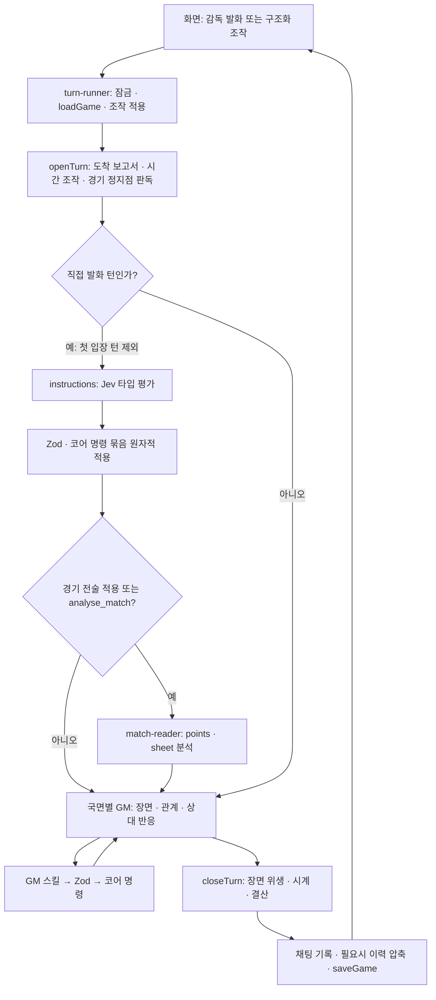

# 한 턴의 파이프라인 — 입력 · 평가 · 장면 · 코어

감독의 말은 먼저 직접 지시로 평가되고, 검증된 변경과 현재 상태를 받은 GM이 장면을
쓴다. 상태 변경은 **검증된 코어 명령**을 통해서만 일어난다. 직접 지시의 타입 선택과
GM의 스킬 호출은 그 명령에 들어가는 서로 다른 입구다. 장면 본문을 다시 읽어 명령을
만들지 않는다.

책임과 호출 관계는 [agents.md](agents.md), 입력·출력 문법은 [prompts.md](prompts.md),
제공자·모델·예산·추적은 [models.md](models.md)가 원본이다.

## 1. 요청에서 저장까지

`runGmTurn`의 순서는 `openTurn → runInstructions → 조건부 경기 판독 → callGm →
closeTurn`이다. 시간 손잡이 등 `operation`이 있는 턴, 경기 첫 입장(`kickoff`), 협상
첫 착석(`seating`)은 직접 지시 평가를 건너뛴다. 공백 발화도 평가 호출 없이 끝난다.

웹의 `runTurnLocked`는 잠금 안에서 게임을 읽고 성공한 턴만 저장한다. 턴 전체가 실패하면
그 요청의 메모리 변경을 저장하지 않는다. 직접 지시 묶음 내부의 원자성과 별개로,
이 저장 경계가 요청 전체의 롤백을 맡는다. 진단 트레이스와 사용량은 실패해도 남을 수
있으며 게임 상태의 성공 기록과 구별한다.

| 입출력    | 내용                                                                                         |
| --------- | -------------------------------------------------------------------------------------------- |
| 요청      | `message` 또는 구조화된 `operation`; 전술판 `orders[]`는 모델보다 먼저 코어가 검증·적용      |
| 조작 기록 | 이미 적용한 변경을 GM에게 전달하고, 필요한 지시 문맥에는 `board_moves`로 제공                |
| 스트림    | `delta` 장면 조각 · `ping` 하트비트 · `done` 게임 페이로드 · `error` 문구와 재시도 가능 여부 |
| 저장      | 장면, 성공한 명령 기록, 사건·보고서·카드, 코어가 확정한 상태                                 |

## 2. 직접 지시 — GM 앞의 하나의 평가 경로

`app/workflows/instructions.ts`가 현재 국면에 맞는 명령 목록과 문맥을 조합하고,
`common/instruction-compiler.ts`가 `GameEvaluator`로 닫힌 질문을 평가한다.
Jev는 GM 스킬을 갖지 않는다. 선택·수치에 대한 **평가 출력**을 반환하고, 앱이 기존
명령의 Zod와 결정론적 핸들러로 전달한다.

| 국면    | 명령·문맥의 범위                                                               | 뒤에서 장면을 쓰는 GM |
| ------- | ------------------------------------------------------------------------------ | --------------------- |
| 평시    | 전술·훈련·시장 명령 목록, 선수·일정·재정의 현재 사실                           | `gm`                  |
| 협상 방 | 현재 협상의 테이블 명령, 서류·대화·조건                                        | `negotiation-gm`      |
| 경기    | 경기에서 허용한 전술 명령, 현재 장부·선수·전술; 별도 분석 의도 `analyse_match` | `match-gm`            |

도메인의 `tactic-orders`, `training-orders`, `market-orders`, `table-orders` 모듈은
명령 목록과 문맥을 소유한다. 별도 생성형 에이전트나 GM이 부르는 라우팅 스킬이 아니다.
런타임 의존성은 `common → {story, negotiation, match} → app`을 유지한다.

평가는 명령 의도와 인자를 선택한다. 단순한 스칼라 지시는 보통 두 평가 단계이며,
배열·객체는 필요한 깊이만큼 확장한다. 모델의 선택 확률은 **그 해석의 확률**이다.
압박 강도·금액·관계 효과에 곱할 배율이 아니다. 유일한 과반 선택을 요구하는 규칙은
불명확한 지시를 실행하지 않기 위한 보수적 경계이며, 보정된 정확도 보증이 아니다.
자세한 후보·크기 제한은 [agents.md](agents.md) §1과 실제 컴파일러가 정의한다.

적용은 다음 경계를 지킨다.

1. 해석이 불명확하면 발화 전체를 확인 대상으로 반환한다. 명확한 일부만 먼저 적용하지 않는다.
2. 상태 복사본과 별도 호출 기록으로 명령을 실행하고, journal도 임시 수집한다.
3. 모든 명령이 성공해야 상태·호출 기록·명령 journal을 함께 확정한다. 하나라도 코어가
   반려하면 묶음 전체를 버린다. 평가 시도 자체의 진단 기록은 이 성공 기록과 별개다.
4. 적용·반려 결과는 `<instruction_results>`로 GM에게 간다. GM은 적용한 지시를 다시
   실행하지 않고, 확인할 부분을 장면 속에서 묻는다. 빈 명령 묶음은 변경을 만들지 않는다.

목록의 추가·제외는 현재 명단을 보존하며, 명시적인 전체 해제와 대상 누락을 구별한다.
선수의 존재·자격, 실제 금액·계약·전술의 허용 범위는 기존 Zod와 코어가 최종 검증한다.

## 3. 세 GM의 입력과 스킬

`state.phase`는 앱의 라우팅 값이다. 모델에 분기 코드를 설명하는 입력으로 싣지 않는다.
세 GM은 각 경험의 장면과 인물 반응을 맡는다.

| GM               | 장면의 책임                              | 직접 부르는 스킬                                                                 |
| ---------------- | ---------------------------------------- | -------------------------------------------------------------------------------- |
| `gm`             | 일상·훈련·언론·보드·관계                 | 조회와 기존 이야기·진행 스킬. `team_talk`, `start_match`, `start_negotiation` 등 |
| `negotiation-gm` | 설득·상대의 논거·조건과 반응             | `counterparty_reply`, `leave_negotiation`                                        |
| `match-gm`       | 코치와의 대화·확정 사건 중계·경기 마무리 | `finalize_match`, `team_talk`                                                    |

스킬은 모델이 직접 부르는 도구만 가리킨다. 내부 판정기의 JSON은 출력 스키마이고,
그 결과로 앱이 호출하는 함수는 코어 명령이다. 전체 이름·호출 관계는
[agents.md](agents.md) §1의 표를 따른다.

경기 첫 입장과 협상 첫 착석·일어서는 조작 턴은 도구 없이 장면을 쓴다. 경기의
구조화 조작 턴에는 `finalize_match`만 제공한다. 도구의 Zod가 잘못된 인자를 반려하면
수정할 부분을 도구 결과로 돌려준다. 성공한 상태 변경은 `recordCall`로 남고, 조회는
상태 변경 칩을 만들지 않는다. 도구 왕복은 어댑터의 상한과 호출 전체 시한 안에서 돈다.

### 입력 층과 캐시

입력은 변경 빈도가 낮은 것부터 조립한다. 캐시 지원·요금은 제공자 설정과 실제
사용량을 따른다. 특정 할인율이나 캐시 적중을 보장하지 않는다.

| 층        | 평시                               | 협상                                | 경기                                           |
| --------- | ---------------------------------- | ----------------------------------- | ---------------------------------------------- |
| 고정      | `GM_SYSTEM` · GM 도구 정의         | `NEGOTIATION_GM_SYSTEM` · 방의 도구 | `MATCH_GM_SYSTEM` · 경기 도구                  |
| 레퍼런스  | 구단·감독, 압축 요약이 있으면 요약 | 구단·감독·상대 서류·상황            | 구단·감독·수석코치·경기 전 발화                |
| 이력      | 평시 채팅 창                       | 현재 협상 id의 채팅                 | 해당 경기 `casterHistory`; 첫 입장만 평시 이력 |
| 이번 턴   | 인물 카드·조작·감독 발화           | 방의 발화·착석 표식                 | 발화·첫 휘슬 표식·확정 사건                    |
| 상태      | 현재 스냅샷 + 지시 적용 결과       | 테이블 조건·앵커 + 지시 적용 결과   | 장부·전술 포인트 + 지시 적용 결과              |
| 도구 결과 | 조회·코어 실행의 답                | 상대 판정·퇴장 결과                 | 팀토크·마감 결과                               |

평시의 이번 턴 메시지와 다음 턴 이력의 같은 자리는 `renderTurnGroup`이 그린다.
날짜·선수 상태 같은 가변 사실은 고정층에 넣지 않는다. `stateNote`는 발화 뒤에 붙고,
`operator_channel` 설정에 따라 별도 메시지 또는 유저 메시지 꼬리로 전달된다.
반환 이력에는 상태 스냅샷을 누적하지 않는다.

이력 창과 압축 시점은 코어의 `history-window.ts`가 정한다. 접히는 원문에는
`turnFactLines`의 장부 사실을 함께 보내고, `history-compactor`가 요약을 반환한다.
압축은 저장 직전에 필요할 때만 돌며 실패하면 접지 않는다. `state.chat` 전체와 화면의
이력은 그대로 남는다. 평시·협상·경기 이력을 무작정 하나로 합치지 않는다.

## 4. 경기 — 지시·판독·중계·결산

경기 결과·시각·사건은 결정론적 코어가 정한다. 화면의 예측 진행과 서버의 확정
체크포인트를 구분하며, 턴은 확정 상태를 읽는다. 모델이 중계에 적은 득점·분을
장부로 되읽지 않는다.

- **직접 전술 변경:** 지시 평가와 코어 적용이 먼저다. 성공한 경기 지시가 있거나
  `analyse_match` 의도를 골랐을 때만, GM 전에 `readMatchAfterInstructions`가 판을 읽는다.
  `analyse_match`는 구체적인 공간·마킹·약점 분석을 요청하는 타입 의도이며 GM 스킬이나
  새 에이전트가 아니다. 단순 대화에는 추가 판독을 붙이지 않는다.
- **정지점:** `match_stop` 턴의 `openTurn`에서 골·퇴장·하프타임 등 확정 사건을 읽고
  포인트·시트를 갱신한 뒤 GM이 중계한다. 종료된 장부는 다시 판독하지 않는다.
- **판독 출력:** `match-reader`는 전술 `points`와 연속 강도 `sheet`를 낸다. 코어 명령이나
  팀토크를 내지 않는다. 능력치·포지션·역할·체력·적응도·폼 등 선수의 실제 정보가
  분석 근거로 남으며, 코어가 대상·실재·범위를 검증해 판독을 적용한다.
- **마감:** `finalize_match`는 장부가 있을 때 평점 브리프를 만든 뒤 코어 `finalizeMatch`로
  결과·기준 평점을 확정한다. `finalize-match` 에이전트는 평점·성장·심경만 구조화해서
  돌려주고 코어가 한도를 적용한다. 마무리 장면은 매치 GM이 쓴다. GM이 마감을 놓쳐도
  `closeTurn`의 안전망이 종료 장부를 닫는다. 두 번째 서사 작성자는 없다.

운영 판독기는 생성형 호출로 포인트와 시트를 함께 받는다. Jev가 시트 강도만 따로
평가하는 경로는 [기록 입력 비교](match-reader-evaluation.md)의 **미채택 시범**이다.
확률 기대값을 강도로 쓰는 이 실험과 직접 지시의 Choice 확률은 별개 계약이다.

판독 산출 검증이 재시도 뒤에도 실패하면 새 판독을 적용하지 않는다. 정지점의 호출
실패는 이전 포인트·시트를 유지한다. 직접 지시 뒤 판독의 전송 오류는 상위 턴으로
올라가므로 요청의 저장 경계를 따른다. 판독 실패가 이미 확정한 경기 사건을 바꾸지는 않는다.
경기에서 평시로 전하는 결과는 코어의 `matchDigest`가 장부에서 만든다.

## 5. 협상 — 감독의 조건과 상대의 반응

협상 턴의 앞에서 코어가 감독 발화를 테이블에 기록하고(`sitAtTable`), 직접 지시
평가가 현재 방의 명령만 적용한다. 협상 GM은 그 결과와 새 테이블을 받아 상대의 말을
쓴다. `counterparty_reply`의 논거·입장·판정은 코어가 앵커와 허용 범위로 검증하며,
금액·계약·약속의 장부는 코어가 유지한다.

상대는 메인 채팅 전체를 읽지 않는다. 입력은 이 협상의 서류·상황·대화·앵커다.
`leave_negotiation`이나 일어서는 구조화 조작은 방을 닫는다. 턴 뒤 협상이 `open`을
벗어났으면 코어가 남은 방도 닫는다. 방 안의 날짜는 고정되고, 헤더는 그날 안의
시각만 옮긴다. 평시로 돌아가는 합의·결렬·조정은 장부와 호출 기록에 남는다.

## 6. 장면 뒤 — 시계와 보조 판정

장면은 위생 처리 후 채팅에 남는다. 평시의 시점 헤더만 코어 시계에 제안되며,
`applyScenePoint`가 되감기·경기일·기한·시즌 경계를 검증한다. 출처는 셋이다.

| 출처       | 날짜의 주인                                                 |
| ---------- | ----------------------------------------------------------- |
| `header`   | 일반 평시 턴: 마지막 장면 헤더를 코어가 검증                |
| `operator` | 시간 조작 턴: `advanceForOperation`이 장면 전에 이동한 날짜 |
| `ledger`   | 경기·협상: 장부가 정한 날짜; 경기 표시 분도 장부에서 부착   |

골·카드 표식도 장부 사건에서 만든다. 헤더가 누락된 연속 턴은 `noteSceneHeader`가
드러낸다. 장면이 비었지만 성공한 명령이 있으면 그 사실로 내레이션을 세운다.
새 대사를 지어내는 폴백은 없다. 시간·사건·명령·장면이 모두 없는 턴은 취소한다.

| 보조 호출           | 시점·출력                                     | 검증과 실패 경계                                                   |
| ------------------- | --------------------------------------------- | ------------------------------------------------------------------ |
| `training-rater`    | 지난 구간에 소화한 훈련의 적응·자리·능력·심경 | 세션 수에 따른 코어 한도와 결산 표식; 실패해도 진행·기준 상태 유지 |
| `scout-rater`       | 도착한 스카우트 보고서의 평                   | 실패해도 숫자 보고서가 서는 것을 막지 않음                         |
| `history-compactor` | 이력 상한을 넘었을 때 요약·관계 정리          | 코어가 대상·크기·관계를 검증; 실패하면 접지 않음                   |
| `onboarding-judge`  | 새 게임의 배경 판정·첫 장면                   | 자산·시작 사건·문법 검증; 실패하면 게임 생성 중단                  |
| `finalize-match`    | 확정 경기의 평점·성장·심경                    | 코어 앵커·한도·한 번 반영 표식; 실패하면 기준 결산 유지            |

보고서 수집은 턴 앞, 시간 조작 뒤, 헤더 이동 뒤에 필요한 만큼 돈다. 같은 턴의 카드
상한과 이미 조립이 막힌 보고서 집합을 공유한다. 훈련 결산은 실제로 지난 구간만
다루며, 같은 대화가 두 결산에 중복되지 않도록 마지막 결산 이후의 이력을 읽는다.
정확한 수치 한도는 코어 상수와 각 경험 문서를 따른다.

## 7. 실패·재시도·계측

- 생성형 구조화 출력은 `readOutput`의 Zod를 통과해야 한다. 산출이 없거나 잘못되면
  `ModelOutputError`가 되고 `retryOnce`가 한 번 다시 부른다. 인증·연결·예산·시한 등
  `LlmCallError`를 이 경로로 무조건 다시 부르지 않는다.
- GM 호출이 도구를 실행했거나 텍스트 델타를 내보냈으면 전체 호출을 재시도하지 않는다.
  호출 전에 적용한 직접 지시와 그 GM 호출 자체가 남긴 자국을 구별한다.
- TypeSafe의 전송·스키마 재시도는 어댑터의 한 전체 시한 안에서 처리한다. 의미를
  결정하지 못한 지시는 확인 대상으로 반환하지만, 인증·연결 오류를 감독의 말이
  불명확했던 것처럼 바꾸지 않는다.
- 각 호출의 실패는 담당 경계가 처리한다. GM·직접 지시의 인프라 오류는 턴 실패로
  올라가고, 결산·압축 등은 위 표의 폴백을 따른다. 화면은 픽션 밖 배너로 오류와
  재시도 가능 여부를 표시한다. 분류와 문구는 `turn-runner.ts`가 소유한다.
- `withGameUsage`의 사용량 장부와 호출 트레이스는 여러 모델 호출·재시도를 함께
  관찰한다. 실패한 시도도 제공자가 보고한 사용량을 포함한다. 누락된 사용량은 0원
  증거가 아니다. 비용·지연 비교는 실제 전체 경로를 측정하고 모델·버전·가격 조건을 남긴다.

`LLM_MODE=mock`은 생성형 자리에 대본 어댑터를 두고, 직접 지시는 `ordersScript`의
명령 묶음을 같은 Zod·원자적 코어 적용 경계로 보낸다. 이는 자연어 품질 평가가 아니다.
실제 호출의 재현 방법과 한계는 [직접 지시 평가](instruction-evaluation.md)와
[판독기 비교](match-reader-evaluation.md)에 있다.

## 8. 코드 위치

| 책임                     | 위치                                                                                                       |
| ------------------------ | ---------------------------------------------------------------------------------------------------------- |
| 요청·NDJSON              | `apps/web/app/api/games/[id]/turn/stream/route.ts`                                                         |
| 잠금·저장·오류 안내      | `apps/web/application/lib/turn-runner.ts`                                                                  |
| 턴 앞·직접 지시·GM·턴 뒤 | `packages/agents/src/app/gm.ts`                                                                            |
| 타입 평가·묶음 적용      | `packages/agents/src/common/instruction-compiler.ts` · `packages/agents/src/app/workflows/instructions.ts` |
| GM 입력·도구             | `packages/agents/src/app/gm-input.ts` · `packages/agents/src/app/gm-tools.ts`                              |
| 경기 판독·마감 배선      | `packages/agents/src/app/workflows/match/`                                                                 |
| 경기 판독·결산 모델 I/O  | `packages/agents/src/match/match-reader.ts` · `reader-pipeline.ts` · `finalize-match.ts`                   |
| 협상 GM 배선             | `packages/agents/src/app/workflows/negotiation/negotiation-gm.ts`                                          |
| 시계·이력 창             | `packages/engine/src/app/tick.ts` · `packages/engine/src/common/core/history-window.ts`                    |
| 산출 검증·재시도         | `packages/agents/src/common/retry.ts`                                                                      |
| 모델 계약·평가 계약      | `packages/llm/src/game-llm.ts` · `packages/llm/src/game-evaluator.ts`                                      |
| 호출·평가 팩토리·계측    | `packages/llm/src/factory.ts` · `evaluator-factory.ts` · `usage-meter.ts` · `turn-trace.ts`                |
