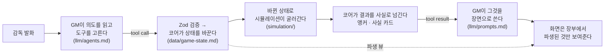
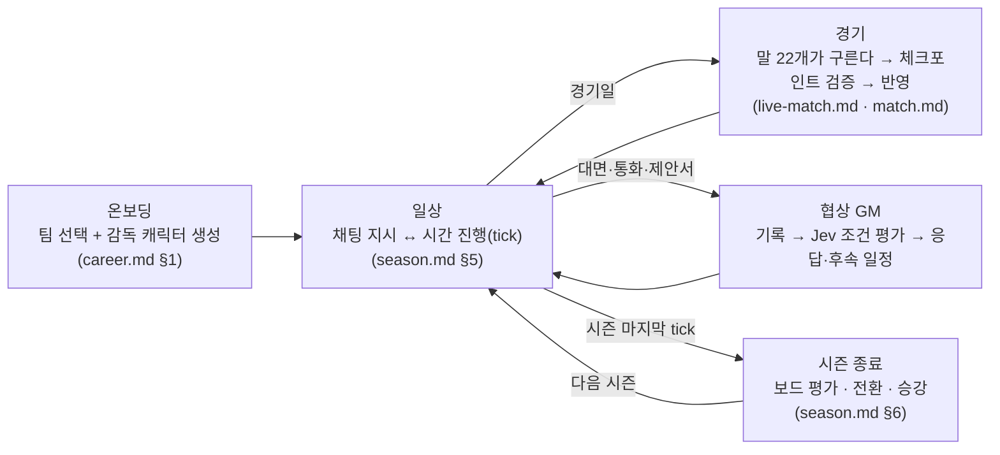

# story-fm — 전체 구조

**게임 전체가 하나의 채팅이다.** 핵심 재미와 책임의 경계는 [책임 구조](architecture.md)에 정리되어 있다. 유저는 감독 한 사람을 연기하고, 모델(GM)이
나머지 세계 전부를 연기한다. 상태를 바꾸는 유일한 통로는 도구 호출과 그것이 부르는 코어 명령이고,
장부(상태·규칙·수치)는 코어가 결정적으로 지킨다.

이 문서는 **무엇이 무엇과 어떻게 이어지는가**를 다룬다. 각 부분의 상세는 링크한
문서가 원본이다.

> 슬라이더와 스프레드시트 대신 **대화**로 팀을 이끈다 —
> 매 시즌이 한 편의 드라마가 되는 AI 풋볼 매니저.

|             | Football Manager | story-fm                          |
| ----------- | ---------------- | --------------------------------- |
| 인터페이스  | 메뉴·슬라이더·표 | 자연어 채팅 (+ 보조 뷰)           |
| 경기        | 2D/3D 엔진 관전  | 실시간 공간 시뮬레이션 + AI 중계  |
| 선수        | 능력치 덩어리    | 능력치 + 캐릭터북(성격·기억·관계) |
| 재미의 중심 | 최적화·성취      | 서사·관계·납득되는 드라마         |
| 결과 설명   | 스탯으로 추정    | 원인 태그로 게임이 직접 설명      |

## 0. 용어 — 셋을 가른다

⚠️ **「스킬」은 LLM이 직접 부르는 것에만 쓴다.** 셋이 다른 층이라 낱말을 섞으면
"에이전트가 도구를 여럿 쥔다"처럼 읽힌다 — 해석기·결산 호출은 도구를 들지 않는다.

| 낱말            | 무엇                                                                                                                  | 예                                                                 |
| --------------- | --------------------------------------------------------------------------------------------------------------------- | ------------------------------------------------------------------ |
| **스킬**        | **LLM이 직접 부르는 도구.** 카탈로그가 이름과 설명을 갖고, 호출이 칩·카드로 남는다                                    | 국면별 GM의 도구 카탈로그                                          |
| **출력 스키마** | 에이전트 호출 하나가 내는 **JSON의 꼴.** 요청이 응답의 꼴로 강제한다 — 도구가 아니다                                  | 온보딩의 `REPORT_ONBOARDING_INPUT` · 타입 평가의 Choice·Score 응답 |
| **코어 명령**   | 코어가 그 JSON이나 스킬 핸들러에서 부르는 **결정적 함수** (`packages/engine/src/{story,negotiation,match}/commands/`) | `set_lineup` · 거래 확정 · 캐릭터북 편집 접수                      |

## 1. 세 가지 경험과 공통 정보

문서와 코드는 같은 도메인 이름을 쓴다. [구조와 책임](architecture.md)에서
패키지별 실행 경계와 파일 위치를 확인할 수 있다.

| 도메인        | 감독이 즐기는 경험                           | AI와 코어의 책임                                                                         |
| ------------- | -------------------------------------------- | ---------------------------------------------------------------------------------------- |
| `story`       | 훈련·일상·기자회견, 쌓이는 서사와 관계       | 메인 GM이 인물의 반응을 판단하고, 코어가 대상·편집 요청과 실제 원장 전이를 검증한다      |
| `negotiation` | 설득과 심리전, 계약·재정·약속 관리           | 협상 GM이 대면·통화·제안서를 진행하고, Jev가 조건을 평가하며 코어가 계약·원장을 확정한다 |
| `match`       | 팀·전술로 치르는 실시간 경기와 자유로운 개입 | 경기 GM이 의도를 해석하고, 공간 코어가 움직임과 승패를 결정한다                          |
| `common`      | 같은 선수와 팀을 모든 경험에서 이해하기      | 선수·팀의 신원, 능력·몸 상태, 카탈로그와 기초 규칙을 한 곳에서 제공한다                  |

`domain` 패키지는 모델·스키마, `engine`은 결정적 상태 전이와 조회,
`agents`는 모델 호출을 맡는다. 각 패키지 안에서 위 네 도메인으로 나눈다.
`app` 조립 계층이 날짜·시즌 진행, 저장과 통합 화면을 연결한다.
자유 텍스트가 장부를 바꾸지는 않으며, 모델의 판단도 검증된 명령을 거친다.

### 네 가지 철칙

1. **LLM의 자유 텍스트는 상태를 바꾸지 못한다.** 모든 변경은
   `도구 호출 → Zod 검증 → 결정적 상태 전이` 경로만 탄다.
2. **경기 결과도 코어가 정한다.** 감독의 경기는 [실시간 경기](match/live-match.md)의
   말들이, 다른 구장은 [간이 시뮬](match/match.md)이 사건을 확정하고 LLM은 중계·연출로
   옮긴다. 감독의 지시는 검증된 명령과 한도 있는 시트를 통해서만 말의 규칙에 닿는다.
3. **시간도 상태다.** 평시 날짜는 시간 진행 조작으로 바뀌고, 실시간 경기 시계는
   클라이언트 실행기가 진행한다. 일시정지·정지점·서버 요청 중에는 실행기가 멈춘다.
   GM의 서술만으로 날짜나 경기 시계를 바꾸지 않는다. 장면 시각의 출처는 코어가
   출처별 표로 갖는다 ([common/llm/agents.md](common/llm/agents.md) §2 「시계」).
4. **코어가 내놓는 것은 사실이다.** 경기·부상·출전·계약·재정의 근거를 제공하고,
   질문·인물의 반응·평가는 GM이 맥락으로 쓴다. 서사는 캐릭터북과 대화 요약에 남고,
   그 문장이 축구·계약 원장을 바꾸지 않는다.

### 사실 카드 — 코어가 쓸 수 있는 네 가지

철칙 4가 실제로 무엇을 허용하는가. 카드에 오르는 값은 넷뿐이다:

| 무엇        | 예                                           |
| ----------- | -------------------------------------------- |
| 원인 코드   | `injury` · `minutes` · `losing-run`          |
| 수치        | 평점 5.4 · 급여 비중 78% · 최종 4위          |
| 기간        | 복귀까지 12일 · 14일째 · 3연패               |
| 등급 (enum) | 폼 `바닥` · 급여 비중 `위험` · 훈련 `steady` |

카드에 오르지 **않는** 것은 셋이다 — 평가어("보드가 만족한다"), 조언("주급 구조를
손볼 때다"), 연출어("쓰러졌다", "여정이 여기서 끝났다"). 문장을 쓰는 쪽은 둘뿐이다:
**GM**(장면·대사)과 **화면**(카드를 사람 말로 옮기는 자리).

⚠️ **같은 규칙이 저장하는 값에도 걸린다.** 장부에 문장을 적어 두면 그 문장이
세이브에 굳어 다시 쓸 수 없다 — 등급과 근거 수치로 적으면 화면 문구를 고치는 것만으로
이미 적힌 기록까지 함께 고쳐진다.

| 자리      | 코어가 내는 카드                              | 문장을 쓰는 쪽               |
| --------- | --------------------------------------------- | ---------------------------- |
| 감독 고용 | 계약·제안·공석·재임 이력과 실제 순위          | GM (평가) · 화면 (커리어 표) |
| 재정 노트 | `FinanceNote[]` — 코드 + 값 + 한도, 조언 없이 | GM (월간 보고 서술)          |
| 골의 원인 | `EventCause[]` — 행동의 사슬 코드 + 선수      | 중계 (매치 GM) · 경기 리포트 |
| 트로피    | 대회 **id** + 시즌 — 표시명이 아니다          | 화면 (커리어 보관함)         |
| 성장·부상 | 출처 코드(`origin`·`cause`) + 축 + 폭         | 화면 (일지)                  |
| 메디컬    | 소견 코드 + 부위 + 잔여 일수                  | 화면 · GM (브리핑)           |

⚠️ **판정도 문장으로 하지 않는다.** 저장한 문장을 다시 읽어 갈래를 가르면(`note`가
"계약 해지"로 시작하는가, 원인 태그에 "승부수"가 들어 있는가) 문구를 고치는 순간
판정이 뒤집힌다. 갈래는 **코드 필드**가 갖는다 — `Transfer.reason`,
`MatchEvent.subCause`, `TrainingSession.menuId`처럼. 그래서
**한국어 문구를 통째로 바꿔도 어떤 판정도 어떤 집계도 달라지지 않는다.**

### 코어가 쓰는 한국어 — 조사는 앞말이 고른다

카드의 사실 문장에는 이름이 그대로 박히고(`${name} …`), 그 문장은 화면의 태그
줄에도 서고 GM 스냅샷에도 실린다. 그래서 **「이(가)」·「은(는)」·「을(를)」 같은 병기
표기를 코어가 쓰지 않는다** — 그것은 조사 자리를 비워 두는 표기지 한국어가 아니고,
감독은 "아스톤 빌라이(가) 역습을 지시했다"를 읽게 되며, 모델은 읽은 말투로 쓴다.

조사는 `packages/domain/src/common/josa.ts`의 `josa(앞말, "이/가")` 하나가 고른다 — 앞말의
마지막 소리에 받침이 있으면 앞쪽, 없으면 뒤쪽이다. 한글은 유니코드 음절의 종성
번호로 재고, 로마자·숫자로 끝나는 이름은 마지막 글자를 한국어로 읽은 소리로 잰다
(근거는 그 함수의 주석). 짝은 여섯 — `이/가` · `은/는` · `을/를` · `과/와` ·
`으로/로` · `이라는/라는`이고, `으로/로` 하나만 **ㄹ 받침이 받침 없는 쪽을 따른다**
(「리버풀로」). 도메인·시뮬·엔진·화면이 같은 함수를 부른다 — 조사표가 두 벌이면
한쪽만 고쳐진다 (AGENTS.md §5 「한 규칙, 한 정의」).

**병기만 병이 아니다.** `${팀}가` 처럼 한쪽을 미리 골라 박아 둔 조사 한 글자도 같은
결함이다 — 앞말이 바뀌는 순간 「아스널가」·「£900k을」·「리버풀와」가 된다. 그래서
규칙은 표기가 아니라 **앞말**이 정한다: 값이 카탈로그·세이브·포맷터에서 오면
(이름 · 금액 · 날짜 · 식별자 · `Record`의 라벨) 조사는 `josa()`가 고르고, 앞말이 그
자리에 리터럴로 서 있으면(「${n}번은」·「${x}명이」) 함수를 부르지 않는다 — 받침이
갈리지 않는 것이 **그 줄에서 읽히기** 때문이다. 한 값만 갖는 상수(`SET_PIECE_KO =
"세트피스"`)도 같다. 호출하지 않은 자리는 그것이 이유다.

**닫는 부호는 소리가 없다.** 감독이 부른 말을 따옴표로 되돌려 주는 문장(`"${ref}"는
여러 선수와 맞습니다`)도, 값을 괄호에 담는 문장(`티켓 합(${slotSum})이`)도 조사는
**부호 안의 앞말**이 고른다 — 사람은 따옴표와 괄호를 소리 내어 읽지 않는다. 따옴표를
인용 표기로 보고 조사를 한쪽에 고정하는 길은 택하지 않았다: 「"리버풀"는」은 어느
표기에도 없는 말이고, 그 문장은 도구 응답과 GM 스냅샷에 실려 모델이 읽는다. `josa()`가
이미 부호를 지나 **소리를 가진 첫 글자**를 찾으므로, 닫는 부호까지 통째로 앞말로
넘기면 된다.

문구만 달라지는 규칙이라 위의 계약은 그대로다: 조사가 바뀌어도 어떤 판정도 어떤
집계도 움직이지 않는다.

## 2. 한 턴이 지나가는 길

감독이 한마디 하면 이렇게 흐른다 — 이 경로가 이 게임의 전부다. 입력이 어떻게
조립되고 출력이 어떻게 파싱되어 코어에 닿는지는 [common/llm/pipeline.md](common/llm/pipeline.md)가
코드 순서 그대로 그린다.



**판정의 책임은 대상이 정한다.** 일반 대화·기사·갈등은 GM이 서술하고
`update_character`로 비동기 편집을 요청한다. 선수 거래 조건은 Jev가 평가하고 코어가
권한·계약·재정을 검증한다. 훈련 결산·경기 평점은 코어 앵커와 한도를 따른다.
`review_board`는 실제 경질·AI 감독 선임, `offer_manager_job`은 감독 계약 제안,
`respond_to_interview`는 실제 채용 면접 결과를 기록한다. 기대·평가·경고는 캐릭터북에 남긴다. 일반 대화에는 감정·평판 수치 판정이나 자동 폼 효과가 없다.
요약 에이전트는 캐릭터북을 편집하지 않는다. 입력 풀은 최대 240명의 이름·설명으로
제한하며, 같은 풀에서 보충해 30명(풀이 작으면 전원)을 후보로 남긴다.
상세는 [캐릭터북](story/character-book.md).

### 시간이 지나간 자리 — 코어는 **사건 배열**을 낸다

손잡이로 며칠을 넘기면 모델보다 코어가 먼저 굴고(§4 ·
[common/season.md](common/season.md) §5), 그 사이 벌어진 일을 **사건 하나에 원소
하나인 배열**로 낸다 — 「 · 」로 이어 붙인 한 문단이 아니다.

```ts
type TickEvent = { kind: TickEventKind; text: string };
// kind: "injury" | "board" | "draw" | "interest" | "matchday" | "news"
```

- **`text`는 코어가 쓴 사실 문장 그대로다.** 종류가 붙는다고 문장이 달라지지 않고,
  종류를 문장 안에 적지도 않는다.
- **`kind`는 코어가 정하고 화면이 읽는다.** 화면은 사건 하나를 **카드 하나**로 세우고
  그 종류로 꼬리표와 픽토그램을 고른다([common/ui/design-system.md](common/ui/design-system.md) §6).
  코어는 꼬리표 글자도 아이콘 이름도 모른다 — 그건 화면의 어휘다.
- **문장에 이모지를 붙이지 않는다.** 종류를 그림으로 말하는 것은 화면의 일이고, 화면이
  쓰는 그림은 24그리드 픽토그램뿐이다(design-system.md §3 허용 글리프 여섯). 코어가
  ⚽·📰를 붙이면 종류가 **두 벌**로 서고, 그중 하나는 화면이 고칠 수 없다.
- **id 목록은 싣지 않는다.** 문장에 선 이름을 손잡이로 잇는 사전은 화면이 이미 짓는다
  (`store.ts` `namesForChat` · [common/player.md](common/player.md) §9.5) — 같은 사실을 코어가
  한 벌 더 내면 두 목록이 언젠가 갈린다.

배열이 가는 곳은 둘이다 — GM 스냅샷의 「그 사이 벌어진 일」(**문장만** 간다. 종류는
화면의 것이다)과, 그 턴의 채팅 기록(`ChatTurn.events` → 사건 카드).

**이 길 전부가 개발 모드에서는 기록으로 남는다** — 감독의 말, 해석기가 낸 명령, 코어가
건 것과 반려한 것, 확정된 체크포인트와 입력 로그, 사건, 그 사이 굴러간 하루하루가 턴
하나의 타임라인에 모델 호출과 나란히 순서대로 쌓인다(`journal`, [common/llm/models.md](common/llm/models.md)
§5). 플레이가 끝난 뒤 「왜 그랬나」를 묻는 자리는 세이브가 아니라 그 기록이다.

## 3. 채팅 문법

| 요소      | 형식                                                                                                                                                                                                                            | 예                                                  |
| --------- | ------------------------------------------------------------------------------------------------------------------------------------------------------------------------------------------------------------------------------- | --------------------------------------------------- |
| 행동·연출 | `*…*`                                                                                                                                                                                                                           | `*고개를 숙인다*`                                   |
| 화자 발화 | `@화자명:` (이름, 직책 아님)                                                                                                                                                                                                    | `@스티브 홀랜드: 죄송합니다...`                     |
| 내레이션  | `@:` — 화자 없는 연출                                                                                                                                                                                                           | `@: *라커룸이 얼어붙는다*`                          |
| 도구 호출 | 구조화된 도구 호출 (칩·카드로 노출)                                                                                                                                                                                             | `update_character({...})`                           |
| 조작      | `<operator>시간 진행 — 하루</operator>` — 손잡이, 감독 발화 아님                                                                                                                                                                |                                                     |
| 다음 말   | `<suggest_reply>…</suggest_reply>` — 모델 턴의 마지막 줄. GM이 감독이 이어 할 말 하나를 내고, 코어가 꺼내 입력창의 placeholder로 세운다 — Tab·→가 입력으로 받는다 ([common/ui/design-system.md](common/ui/design-system.md) §6) | `<suggest_reply>오전 훈련부터 보자</suggest_reply>` |

- **조작은 문장이 아니라 구조체로 온다** — 손잡이는 `TurnOperation`
  (`{ kind: "skip_days" \| "skip_to_next_match", … }`)을 보내고,
  위 표의 문장은 **그 구조체에서 서버가 만든 표시 문구**다. GM이 읽을 것이 있어야
  하므로 문장은 남지만, 되읽는 코드는 없다 — 문구를 바꿔도 시계·배치는 그대로
  움직인다 ([common/llm/prompts.md](common/llm/prompts.md) §1).
- **권한 경계** — 유저는 감독 자신만 움직인다. 유저가 세계를 서술하면 GM은 사실이
  아니라 감독의 시도로 해석해 판정한다.
- 극단 행동도 수용하되 **세계는 반드시 그에 맞게 반응한다.**
- 직책·아이콘은 화면이 붙인다 → [story/people.md](story/people.md)
- **`*…*`는 감독의 말에도 선다** — 감독 턴도 다른 발화와 같은 파서를 지나므로 연출은
  기울고 별표는 남지 않는다. 별표가 몇 개 연달아 오든 구분자 하나로 읽는다.
- **제안은 감독의 말이 아니다.** GM이 낸 다음 말 한 줄은 세이브의 턴(`ChatTurn.suggestion`)에만
  남고 모델 이력·압축·해석기 입력에는 실리지 않는다 — Tab으로 받아 고쳐 쓰든 그대로
  보내든, **보낸 것만** 감독의 말이 된다 ([common/llm/agents.md](common/llm/agents.md) §2).

## 4. 게임 루프

게임은 **7월 1일(여름 이적창 개장)**에 시작한다. 선수단 소집은 7월 둘째 월요일,
개막은 8월 중순 — 프리시즌 동안 영입·훈련·시즌 계획이 선수단보다 먼저 움직인다.



**tick(하루)이 세계를 굴린다** — 훈련·회복·성장·부상, AI 팀의 경기·이적·재계약·
감독 계약 만료, 채용 면접 기한, 협상 후속 이벤트의 도래. 예약된 응답·재논의는 app이 Jev 평가를 직접 실행하고, 메디컬은 실제 건강 상태로 처리한다. 감독의 결정이
필요한 일 앞에서만 멈춘다.
채용·계약과 예약된 협상 후속 이벤트의 기한은 하루 진행에서 처리한다. 협상에서 생긴 일은 요약과 원장 참조로 GM에게 전달되고, GM은 공개 범위 안에서 일상의 반응을 이어 간다.

## 5. 화면

화면은 두 줄이다 — 얇은 상단 띠(시계·팀·**오늘의 안건**)와 **무대**. 무대의 기본은 채팅이고,
경기가 시작되면 왼쪽 경기판 · 오른쪽 중계·지시로 갈린다. 경기판이 세우는 것은 말 22개와
공의 실제 위치 · 스코어와 시계 · 쌓인 xG 계단선 · **시트**다
([match.md](match/match.md) §9). 협상 화면은 **상대·현재 조건·이어지는 대화**을
보여준다. 대면·통화·제안서는 같은 상대의 협상 테이블에 함께 남는다. 선수별 거래
조건은 구분하고, 일상으로 돌아가도 같은 테이블에서 연락을 이어 간다.
성사 확률과 인내 막대는 두지 않는다
([협상](negotiation/transfer.md) §9 · [화면 규약](common/ui/design-system.md) §7-1).

장부 뷰는 오른쪽 위 아이콘 줄에서 연다.

| 뷰     | 내용                                                                                                                                                                                                                                                                                                                                                   |
| ------ | ------------------------------------------------------------------------------------------------------------------------------------------------------------------------------------------------------------------------------------------------------------------------------------------------------------------------------------------------------ |
| 스쿼드 | 전술판(드래그 배치·역할·**세트피스 키커와 가담·수비 두 축**·자동 저장) + 명단(체력·폼·평점·완장과 키커 표식)                                                                                                                                                                                                                                           |
| 달력   | 일정(경기·훈련·이적창·추첨)과 **지나간 날의 일지**(성장·부상·카드·이적·돈·소식) — 칸은 경기만 칩·나머지는 색점, 칸을 열면 상세가 종류별 행(아이콘·대회 칩·승패 색)으로 가른다. 일지는 저장하지 않고 기록 테이블에서 파생한다 ([people.md](story/people.md) §9)                                                                                         |
| 재정   | 월간 보고서·원장·PSR                                                                                                                                                                                                                                                                                                                                   |
| 대회   | 대회별 순위표(진출권·강등 구역 · 전체 경기 성적 · 최근 5경기 폼)·**개인 순위**(득점·도움·평점·클린시트·징계)와 팀 열·라운드 일정·브래킷·**그 대회의** 다음 경기 (경기 중 탭은 팀의 다음 경기 — [match.md](match/match.md) §9.2) · **역대 우승팀**(시즌별 우승·준우승 및 리그 우승 성적, 펼쳐 보는 최종 순위표·시상 — [season.md](common/season.md) §6) |
| 커리어 | 감독 신상·계약·트로피·시즌 기록                                                                                                                                                                                                                                                                                                                        |

- **이름은 손잡이다.** 장부와 이야기에 선 선수 이름을 누르면 그 선수의 카드가
  채팅 위에 덮여 선다 — 경기 종료 카드와 같은 자리라 어느 화면에서도 열린다.
  이름이 아니라 **자리로 선 선수**도 같다: 판세의 마커와 상대 전술판의 칩이 같은
  카드를 연다 ([match.md](match/match.md) §9).
  카드는 매 턴 짐에 실리지 않고 **열 때 하나씩** 오고, 남의 구단 선수는 안개를
  통과한 값만 싣는다 ([common/player.md](common/player.md) §9.5). 손잡이가 서려면 뷰
  행이 이름과 함께 **id**를 들어야 한다 — 이름으로 선수를 되찾는 화면은 동명이인에서
  갈린다.
- **제안서는 초안과 발송을 구분한다.** 선수 카드·협상 기록에서 같은 제안서를 열고,
  감독이 작성한 값과 말을 해당 거래에 전달한다. 제안서 발송·회신도 협상 GM이 주관한다.
  상대 권한에 맞는 조건만 전달하며, 이미 합의한 값을 바꾸면 승인을 다시 받는다.
  [선수 거래](negotiation/transfer.md) §4·§7의 실행 경계를 UI도 그대로 따른다.

- **답을 기다리는 일은 상단 띠가 든다** — 감독직 면접 · 결정이 필요한 협상. 해당 원장에 안건이 있을 때만 표시하며 일반 회견·면담의 대기
  상태를 만들지 않는다. GM 스냅샷과 화면은 같은 코어 조회를 읽는다.
  새 제안·수정 조건·메디컬 소견·확정 승인이 협상 안건이며 단순 접수 확인은 아니다.
  경기와 협상 방에서는 띠를 표시하지 않는다. 띠는 읽는 값이고 결정은 채팅에서 한다.
- 폭 1200px 이상이면 채팅과 장부가 나란히 선다.
- **두 칸의 경계는 감독이 옮긴다.** 둘 사이의 손잡이를 끌면 비율이 바뀐다 —
  중계가 길면 채팅 쪽으로, 명단을 볼 때면 판 쪽으로. 양쪽 최소 폭은 400px이고,
  옮긴 비율은 브라우저에 남아 다음에도 그대로 선다. 두 칸이 나란히 서지 못하는
  폭(경기 판 1024px · 장부 1200px 미만)에서는 손잡이도 서지 않는다.
- **두 칸을 합친 폭은 1520px에서 멈추고 화면 가운데에 선다.** 초광폭 화면에서
  끝까지 벌어지면 채팅과 판 사이를 오가는 시선 이동만 커진다.
- **화면 단계는 네 눈금이다** — 480 · 700 · 1024 · 1200(px). 값은
  `apps/web/domains/common/styles/breakpoints.css`가 `--bp-*`로 혼자 갖고, 다른 스타일 파일은
  그 넷 말고 다른 폭에서 갈리지 않는다. 눈금이 열둘이면 같은 조각이 화면마다 다른
  폭에서 접혀 감독은 어디서 무엇이 바뀌는지 예측할 수 없다. (`@media`는 `var()`를
  읽지 못해 숫자 자체는 각 파일에 서지만, **고르는 값은 이 넷뿐이다.**)
- **읽는 값과 조작 대상은 생김새도 다루는 법도 다르다.** 눌러서 무언가 열리거나
  바뀌는 것만 탭 정지점과 포커스 링을 갖는다 — xG 계단선처럼 읽기만 하는
  표시는 `aria-label`로 읽히되 탭 순서에서 빠진다. 고를 수 있는 눈금(전술 축)은
  라디오 묶음이라 선택 여부가 색이 아니라 `aria-checked`로도 전해진다.
- **한 판에 손잡이가 열 개 넘게 서면 묶음이 정지점 하나를 갖는다.** 판세의 스물두
  마커·상대 전술판의 열한 칩은 각자 카드를 여는 버튼이지만, 그대로 두면 판 하나를
  지나는 데 스물두 번을 눌러야 하고 멈춘 자리마다 포커스 링만 뜬다. 그래서 묶음
  안에서는 **방향키가 자리를 옮기고** 탭은 묶음을 통째로 지난다 — 판 위의 자리는
  줄이 아니라 평면이라 방향키가 고르는 것은 목록의 다음 항목이 아니라 **그 방향에
  실제로 서 있는 가장 가까운 마커**다.
- 결과 표시는 세 길이다 — **칩 + 레일 말풍선**(갈 장부가 있는 호출), **채팅 카드**
  (결정에 필요한 원본 숫자), 그리고 **판세 뷰**(경기 중에만 부를 수 있고 장부에
  흔적을 남기지 않는 호출 — 90분 동안은 장부 레일이 서지 않으므로 시트의
  증거가 판세에 선다). 어느 쪽도 아닌 호출은 노출하지 않는다.
- **연달아 불린 같은 호출은 칩 하나다** — 한 턴에 교체를 셋 하면 칩은 하나고 이름
  옆에 **수 하나**(`3`)가 선다. 펼치면 묶인 호출의 상세가 차례로 서고, 레일 말풍선을
  되부를 때도 묶음이 통째로 선다(그 말풍선은 세 줄에서 접지 않는다 — 감독이 그 묶음을
  보자고 누른 것이다). 사이에 다른 호출이 끼면 접지 않는다: 교체 · 지시 · 교체는 그
  순서가 곧 감독이 한 일이라, 하나로 접으면 순서가 사라진다. 결(`tone`)이 다른 호출도
  갈라 선다 — 결은 펼치지 않아도 보이는 것이라 둘을 접으면 한쪽이 사라진다.
- **호출 결과는 문자열이 아니라 항목이다** — 코어가 머리줄 + 항목(`CommandBrief`)을
  내고 화면이 그대로 세운다. 화면이 요약 문자열을 되쪼개지 않는다. 항목은 **건수와
  갈래까지만** 적는다(`매주 3회 × 6주 — 전술·회복`) — 자세한 일정과 순위는 달력·
  대회 화면이 이미 갖고 있고, 알림은 그 화면으로 보내는 표지다. LLM이 쓴 자유
  문장은 항목에 싣지 않는다 — 그 문장은 장면과 서사 로그에 남는다.
- **화면은 글자를 잘라내지 않는다** — 말줄임(`…`)으로 줄이면 정작 바뀐 값이 그 뒤로
  숨는다. 길이는 코어가 잡고(항목을 짧게, 넘치면 "외 N건"), 화면은 그대로 세운다.
- **화면은 장부에서 파생된 것만 보여준다.** 값이 필요하면 뷰(`views.ts`)가 **항목으로**
  내고 화면은 읽어 세운다. 화면이 따로 계산하면 같은 값이 두 숫자로 보이고, 코어가
  문구를 고치면 화면이 조용히 깨진다. 그래서 화면에는 **코어·시뮬의 임계값 리터럴이
  없고**(급여 비중 경계, 평점 구간, 적응도 경계) **코어가 낸 문자열을 정규식으로
  되쪼개지 않는다**(항목의 이름·값 가르기, 사족 떼어 내기).
  - **예외는 없다.** 다만 **아직 저장되지 않은 조작**을 그리는 자리(전술판 — 칩을
    옮기는 3초 동안은 물어볼 뷰가 없다)는 화면이 값을 직접 낸다. 그때도 규칙을 옮겨
    적지 않고 **코어와 같은 함수**를 부른다 — `observedFit`(자리 전력)·
    `roleAtSlot`(자리의 역할)·`roleChangeCost`(역할 대가). 규칙이 도메인에 하나로
    있는 한 화면과 서버가 갈릴 자리가 없다.
- **금액은 자가 하나다** — `formatMoney`(도메인). **금액이 눈금을 고른다**: 백만
  이상은 `£12.0M`, 그 아래는 `£40k`. 화면·조회 응답·다이제스트·협상 메시지가 모두
  이 함수를 부른다 — 같은 £900k가 카드에서 `£0.9M`, 원장에서 `£900k`로 서면 감독은
  두 숫자가 같은 돈인지 알 수 없고, `£12000k`는 그대로 모델의 컨텍스트에 들어간다.
- **장부 뷰는 사실을 낸다 — 문장은 화면이 조립한다.** 접힌 재정 줄은 명세 목록과
  세는 단위(`명`·`건`)로 오고 "외 N건"은 화면이 붙인다. 컵 진행도 단계와 결과로 오고
  "8강 탈락"은 화면이 잇는다. 뷰가 문장을 내면 화면은 그것을 되쪼개게 된다.
  (말풍선 항목은 다르다 — 한 줄에 들어야 해서 길이를 코어가 잡는다. 위 참조.)
- **바꾼 뷰만 내려온다.** 전술판 저장처럼 장부 하나만 건드리는 조작의 응답은 그
  뷰 하나를 싣고, 화면은 그것만 갈아끼운다. 턴 응답만 전부를 싣는다 — 시간이
  흐르면 무엇이든 달라질 수 있기 때문이다. 판을 짜는 3초마다 채팅·순위·일정까지
  다시 그리면 감독은 전술판만 만졌는데 화면 전체가 흔들린다.
- **턴 실패 배너는 서버가 무엇을 했는지까지 말한다.** 화면이 기다리기를 멈춘 것과
  서버가 턴을 버린 것은 다른 사건이다 — 앞의 경우 서버는 그 턴을 끝까지 돌려 저장하므로
  화면은 상태를 다시 받아 맞추고, 전술판 대기열과 입력창은 되돌리지 않는다.
  **다시 보내면 통하는지도 서버가 적어 보낸다** — 요청이나 설정이 틀려 몇 번을 불러도
  같은 실패에는 배너가 「다시 시도」를 세우지 않는다
  ([models.md](common/llm/models.md) §1-1).
- UI에 조작법 안내 문구를 넣지 않는다 — 조작은 보이는 것으로 알린다.
- 색·서체·간격·모서리·모션의 값과 구단 색을 세우는 규칙은
  [common/ui/design-system.md](common/ui/design-system.md)가 갖는다.

## 6. 세계의 규모

- **5대 리그 96팀**이 리그전을 돌고, 컵용 2부 64팀 + 이적시장 전용 리그(사우디·
  MLS)가 있다. **1부 96팀은 전부 실선수 시드** — 2,681명이고, 2부 시드 4팀까지
  세면 2,797명이다 → [common/sources.md](common/sources.md)
- 시즌 2,300여 경기 중 감독의 관전 경기는 공간 시뮬, 나머지는 간이 시뮬 —
  **LLM은 한 경기도 결정하지 않는다.**
- 국내 컵 6종 + 유럽 대항전 3종 + 슈퍼컵 6종이 돈다. **대항전 정원은 다섯 나라
  1부가 받는 티켓 수의 합이다**(UCL 24 · UEL 16 · UECL 10) — 우리가 갖고 있지 않은
  리그의 몫은 2부로 채우지 않고 비워 둔다. 국내 컵만은
  나라마다 32클럽이라 진입 라운드를 실제 규모로 못 연다 — 그래서 32클럽이 서는
  라운드의 이름으로 시작한다 → [match/competition.md](match/competition.md)
- 세계는 감독 없이도 움직인다 — AI 팀끼리의 선수 이적·재계약, 감독 계약 만료, 대표팀 소집과
  세계 유스 생성, 리그 전체의 피로·회복·징계.

## 7. 현재 구현 범위

플레이 가능한 프로토타입(세이브 18 · 게임 버전 16.0.0). 온보딩 → 일상 지시 → 경기 → 시즌 전환 → 멀티시즌이
엔드투엔드로 돈다. 현재 구현 범위는 다음과 같다. 상세 규칙은 각 도메인 문서가 소유한다:

- **선수 거래:** 대면·통화·제안서는 상대별 기록을 공유한다. Jev가 조건 묶음·상대 입장·
  선택적 후속 일정을 평가하고, 코어가 권한·합의·실행 가능성을 검증한다.
  재연락·메디컬 예약은 날짜 진행에서 처리하며 실패한 평가는 대기 상태로 보존한다.
- **스카우팅:** `request_scouting`이 의뢰를 접수하고 Jev가 예상 정보 수준과 보고 일수를
  정한다. 예정일의 자료를 고정해 보고서를 만들고 같은 턴의 GM 설명과 카드로 전달한다.
  공개 프로필·계약, 실제 경기·시즌 기록, 부상 이력과 기존 보고서가 근거다.
  자료가 없는 능력이나 성장 가능성은 판단을 보류한다. 재열람은 평가를 다시 실행하지 않는다.
- **AI 세계 시장:** 사용자 거래와 별도로 확률·가격 공식에 따른 자동 이적·재계약을
  실행한다. AI 재계약은 해당 선수의 열린 사용자 협상을 닫는다
  ([협상 §10](negotiation/transfer.md#10-ai-구단의-자동-시장과-구현-범위)).
- **모델 설정:** 협상 조건 평가는 `negotiation`, 조사 계획·보고는 `scouting` 역할을 사용한다.
  개발용 mock에서는 상대 동의를 만들지 않고 검토 중으로, 조사 결과는 판단 보류로 남긴다.

- 보드 요청은 GM이 구단주의 판단·금액·기한을 명시하고 코어가 권한·현금·실행 가능성을
  검증한다. 매각 대금·주급 조건은 원장으로 확인하며, 맥락 조건은 GM의 후속 판단을 기다린다
  ([negotiation/finance.md](negotiation/finance.md)).
- 캐릭터북 편집은 비동기다. 접수는 완료가 아니며 완료한 항목은 다음 모델 호출부터
  사용할 수 있다. 실패 시 기존 항목과 요청을 보존한다.

## 문서 지도

|                | 문서                                                       | 다루는 것                                                                       |
| -------------- | ---------------------------------------------------------- | ------------------------------------------------------------------------------- |
| **데이터**     | [common/game-state.md](common/game-state.md)               | 2-레이어 · 엔티티와 관계 · 파생 · 세이브 정책                                   |
|                | [common/player.md](common/player.md)                       | 능력치 16축 · 역할 · 폼 · 체력 · 성장 · 적응도 · 안개                           |
|                | [common/team.md](common/team.md)                           | 구단 체급 · 프로필 · 1·2군과 등록 명단 · 팀의 종류                              |
|                | [match/competition.md](match/competition.md)               | 리그 · 국내 컵 · 유럽 대항전 · 승강의 규정                                      |
|                | [story/people.md](story/people.md)                         | 캐릭터북 · 화자 · 스태프 · 완장 · 멘토링                                        |
|                | [common/sources.md](common/sources.md)                     | 선수·팀 데이터의 출처와 적재 규칙                                               |
| **시뮬레이션** | [match/live-match.md](match/live-match.md)                 | 실시간 경기 — 말의 규칙 · 전술 · 시트 · 부하 · 클라이언트 시뮬과 검증           |
|                | [match/match.md](match/match.md)                           | 경기 능력 · 장부 · 벤치 · 경기 후 반영 · 간이 시뮬 · 상수와 근거                |
|                | [match/football-reference.md](match/football-reference.md) | 실제 축구 통계 — 밸런스의 기준점                                                |
|                | [common/season.md](common/season.md)                       | 달력 편성 · tick · 훈련 계획 · 시즌 전환                                        |
|                | [negotiation/transfer.md](negotiation/transfer.md)         | 선수 거래 · 연락 기록 · 스킬 · Jev 조건 평가 · 후속 이벤트                      |
|                | [negotiation/scouting.md](negotiation/scouting.md)         | 의뢰 · Jev 조사 계획 · 정보 수준 · 예정일 보고 · 기록                           |
|                | [negotiation/finance.md](negotiation/finance.md)           | 수입·지출 · 상각 · PSR · 강등의 타격                                            |
|                | [story/career.md](story/career.md)                         | 감독 기록 · 고용 · 보드 · 트로피                                                |
|                | [common/balance-harness.md](common/balance-harness.md)     | 밸런스 하네스 — 무엇을 재고 어느 대역을 지키는가                                |
| **LLM**        | [common/llm/pipeline.md](common/llm/pipeline.md)           | 한 턴의 파이프라인 — 입력 조립 · 출력 파싱 · 직접 지시·GM 스킬 · 실패 (mermaid) |
|                | [common/llm/agents.md](common/llm/agents.md)               | 생성·평가 역할의 계약 · 결산과 교섭 · 입력 층 · 스냅샷 · 조회                   |
|                | [common/llm/prompts.md](common/llm/prompts.md)             | 프롬프트 원칙 · 입력의 해부 · 출력 문법 · 도구 표면                             |
|                | [common/llm/models.md](common/llm/models.md)               | 에이전트별 모델 설정 · 어댑터 · 실패 종류 · 토큰 예산                           |

> 비전과 개발 규약은 저장소 루트의 [AGENTS.md](../AGENTS.md).
